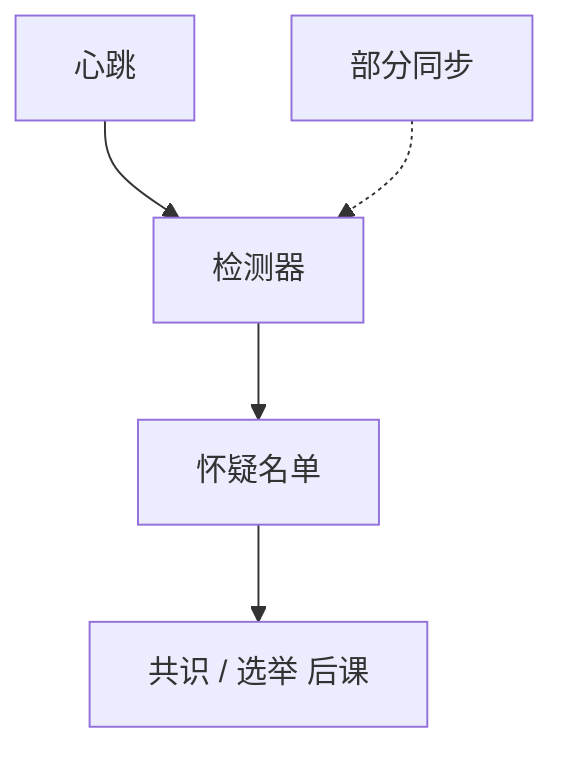

# 故障检测器

异步里不能可靠地知道谁死了。把「怀疑」做成预言机：完备与准确分档，共识的最小档是 $\Diamond\mathcal{P}$。

<footer>—— 据 Chandra and Toueg, Unreliable Failure Detectors for Reliable Distributed Systems, JACM 1996；Chandra, Hadzilacos and Toueg, 1996 整理</footer>

上一课[快照](/cs/chandy-lamport)能切一致状态，切不出「这个进程还会不会再发消息」。上一课之前的[异步模型](/cs/sync-async-model)里，超时不是原语。缺口是**把怀疑从协议里抽出来**：检测器输出「我怀疑 $p$」，协议只读这张名单。本课不重做崩溃定义。后课租约是检测器在实现里的一种带期限的形式。

## 问题

崩溃停进程终将停止发消息；异步调度可以让活进程任意久不出现。任何基于超时的本地判断都可能错。Chandra–Toueg 不消除错误，而是给检测器**性质**：

- 完备（completeness）：真故障终被所有正确进程怀疑。
- 准确（accuracy）：永不（或最终永不、或至少有一个正确进程永不）误伤正确进程。

最强 $\mathcal{P}$（Perfect）：强完备 + 强准确。最常用 $\Diamond\mathcal{P}$（eventually perfect）：终有一时刻之后，怀疑名单恰好是故障集。$\Diamond\mathcal{S}$ 更弱，却已够异步崩溃共识（配多数派）。

CHT 1996 证明 $\Diamond\mathcal{S}$ 是无初始值共识的最弱检测器。本课记结论，不搬归约证明。

## 方法

实现上几乎都是心跳 + 自适应超时（φ accrual 等）：部分同步下终将成为 $\Diamond\mathcal{P}$。算法分层：共识模块只调用 `suspect(p)`，不内嵌 RTT。这样同一套 Paxos 可以换检测器实现。

错误怀疑的代价：把活领导者踢掉，活性抖动，安全性仍应成立——这把[时间模型](/cs/sync-async-model)里「安全异步、活靠同步」说成了接口。

## 机制

强准确在真实网络几乎得不到：偶发长延迟就会误杀。所以工程检测器是 $\Diamond$ 类。心跳间隔与超时是运维旋钮，不是规格：调小则快但误伤多，调大则故障切换慢。租约下一课把「准确直到到期」做成短时的强准确窗口。

漏发故障下，检测器看到的是「不说话」，与崩溃不可分。拜占庭下「心跳还在」不表示协议被遵守，检测器抽象要另做——后课 PBFT 用法定人数与视图更换，不是 Chandra–Toueg 原版。

本课不把 Kubernetes liveness probe 当 $\mathcal{P}$：探针失败只是本地重启策略，没有分布式完备性证明。

## 边界

本课不证最弱检测器，不写 φ 的公式。不把监控告警当成检测器输出。后课默认：异步共识读 $\Diamond\mathcal{S}$ 或更强；实现用心跳逼近 $\Diamond\mathcal{P}$；误怀疑只许破坏活性。快照不是检测手段。

没有这层抽象，超时会偷偷写进安全证明，FLP 的异步前提就被偷换。

## 小结

- 检测器把不可靠怀疑做成带完备/准确档的预言机。
- $\Diamond\mathcal{S}$ 已够崩溃共识；$\mathcal{P}$ 在真实网络不可得。
- 心跳实现依赖部分同步；安全仍按异步证。
- 出处：Chandra and Toueg, JACM 1996；Chandra, Hadzilacos and Toueg。
