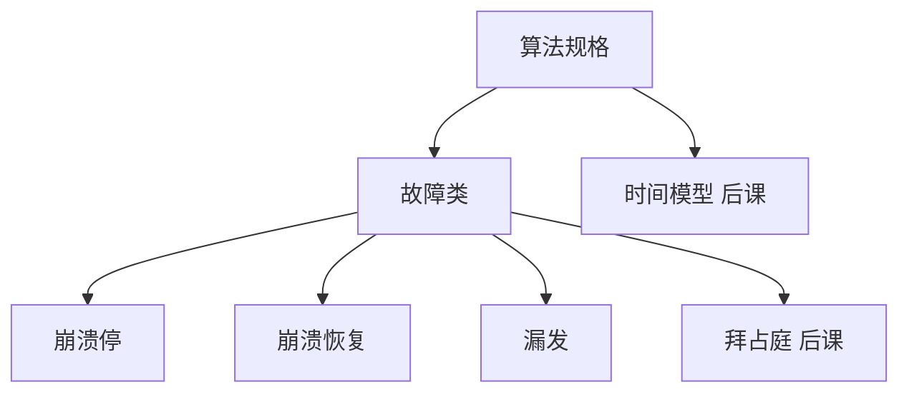

# 故障模型

分布式算法的正确性只相对声明的故障类成立：崩溃停、崩溃恢复、漏发、拜占庭。模型弱一分，可证明的保证就少一分。

<footer>—— 据 Lynch, Distributed Algorithms, 1996；Cristian, Understanding Fault-Tolerant Distributed Systems, CACM 1991 整理</footer>

[上一课](/cs/db-audit)把数据库进阶收到审计与责任。[证明助手](/cs/proof-assistants)已把「正确」收成可检查的项，本课不重开类型论，也不重写事务 ACID。缺口是**进程与信道会坏**：没有故障类，后面的时钟、检测器、共识都没有前提。后课默认已经读完本课：谈到容错，先问崩溃还是拜占庭、停机还是恢复。

## 问题

单机课把崩溃当成进程结束；分布式里「对方没回」可能是慢、丢包、或已经死。缺口不是再列 errno，而是把行为收成**可组合的对手**：

- **崩溃停（crash-stop）**：故障进程从此不再发消息，也不执行步骤。
- **崩溃恢复（crash-recovery）**：可以带着稳定存储回来，易失状态丢失。
- **漏发（omission）**：该发的没发或该收的没收，进程本身还在跑。
- **拜占庭（Byzantine）**：任意偏离协议，包括撒谎与合谋。后课才展开。

信道可以可靠、公平丢失、或完全由对手调度。Lynch 的 I/O 自动机把进程与信道都写成带故障动作的自动机；本课只要这张分类表。

Cristian 1991 把故障按「能做什么」分层，而不是按硬件零件。崩溃是拜占庭的真子集：能证的拜占庭协议在崩溃下仍对，反过来不成立。

## 方法

写规格时先钉故障类，再钉时间模型（下一课）。算法的「容忍 $f$ 个故障」是相对于该类：$n=2f+1$ 的崩溃共识与 $n=3f+1$ 的拜占庭共识不是同一不等式。稳定存储把崩溃停改成崩溃恢复：恢复后必须用日志或纪元拒绝过期消息。

不要把「网络分区」写成第五种进程故障：分区是信道连通性的对手，进程可能都还活着。后课 CAP 会用到这一点。

## 机制

崩溃停最利于证明：故障进程退出全局状态。实现上超时把「可能死了」当成崩溃，于是**错误怀疑**会把活进程当死——那是[故障检测器](/cs/failure-detectors)的缺口，本课只声明：检测不是模型的一部分，模型是真实行为。漏发可以模拟长时间不回，与异步调度叠在一起时，外部观察与崩溃停不可分。拜占庭包含漏发与崩溃，还包含伪造：认证信道（数字签名）可以把「任意」收成「对称」或「能验身份」。

恢复：进程带着磁盘回来，但内存里的 ballot、term 丢了。协议必须把决策写进稳定存储，否则恢复节点可以改口，把崩溃停证明作废。

本课不把数据库的介质故障、操作系统的内核 panic 再讲一遍：那些在单机栈已经是崩溃。分布式课要的是**对其他节点可见的行为类**。

## 边界

本课不证 FLP，不引入部分同步，不写拜占庭将军的口头/书面协议。不把云厂商的 SLA 当成故障模型。后课默认：进程故障先按崩溃停思考，需要磁盘回来再升级到崩溃恢复；任意恶意放到拜占庭课。时间假设下一课才加。

故障类是对手的语言，不是监控仪表盘上的红点。没有这类声明，后面每一条「多数派」都没有分母。

## 小结

- 崩溃停、崩溃恢复、漏发、拜占庭是递增强的对手。
- 「容忍 $f$」相对故障类与 $n$；信道分区另计。
- 检测与超时是实现，不是模型本身。
- 出处：Lynch, *Distributed Algorithms*；Cristian, 1991。
