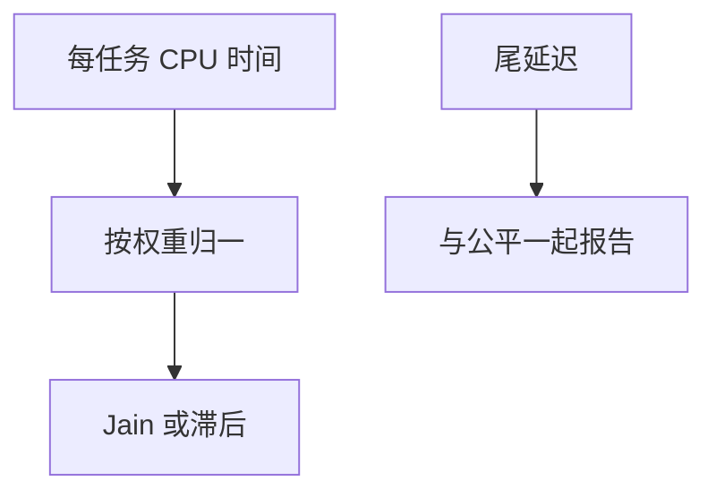

# 公平性度量

公平不是口号：Jain 指数、滞后、每任务实际份额对权重的偏差，才能比较 CFS、EEVDF 与组调度。

<footer>—— 据 Jain, Chiu, Hawe 对公平指数的定义；Silberschatz 对调度指标的整理；[调度指标](/cs/scheduling-metrics) 为先修</footer>

[协作](/cs/cooperative-scheduling) 会饿死。[EEVDF](/cs/eevdf)/[cgroup](/cs/cgroup-cpu-sched) 声称公平。缺口是 **量公平**：与 [cyclictest](/cs/latency-measurement) 的延迟维正交。

## 问题

吞吐高可以很不公平。滞后（lag）：应得虚拟时间与实际之差。Jain：$(\sum x_i)^2 / (n \sum x_i^2)$ 近 1 则均。缺口：加权公平要把 $x_i$ 除以权重；短任务样本会噪；与尾延迟同时报才完整。本课不把排队论证明写完。

max-min 公平是另一目标。网络 qdisc 的 fq 也在用类似语言，对象不同。

## 方法

跑混合负载 → 记每任务 CPU 时间 → 算加权份额误差与 Jain。对照 blk BFQ 的带宽公平。对照 [memcg](/cs/memcg)：内存没有 Jain 默认，但可同样定义。对照 RT：公平让位于截止。

## 机制

度量让调度课从故事变成可证伪。没有它，EAS 省电也可能被说成「更公平」。不要写成论文造数。与 [perf](/cs/perf-sampling) 后课：采样是工具，指标是定义。

实验必须固定拓扑与频率，否则公平被 DVFS 搅浑——下一课 governor。

实现上：短任务样本会让 Jain 指数噪声很大，要按加权 CPU 时间而非完成个数。DVFS 让「时间份额」和「指令份额」分家，实验要锁频。滞后可正可负，长期应在零附近。 读法上只引用[上一课](/cs/cooperative-scheduling)的结论，不把对象换成训练推理或限价簿。

本课在操作系统进阶的「调度进阶 / 公平、实时与能耗」课序里，对象是 **公平性度量**。

- 先修只引用，不重导：上一课的结论当公理，本课只补差。
- 五栏不吞并：不把本课写成大模型训练/推理，也不写成限价簿或权重量化。
- 文献用 OSTEP、McKusick、内核文档与具名会议论文；不发明 arXiv 编号。

## 边界

本课不引入所有学术公平定义。不保证云「可抢占 VM」的商业公平。下一课频率：cpufreq governor。

版本字段会变，课序钉的是机制对象「公平性度量」，不是某一主线内核的结构体名。
后课默认：公平用份额偏差/Jain 等可计算。CPU 频率策略，下一课。

## 小结

- 公平用滞后、加权份额、Jain 等度量。
- 必须与延迟分开报告。
- cpufreq governor 是下一课。
- 出处：Jain et al.；Silberschatz *OSC*；Linux 调度文档。
