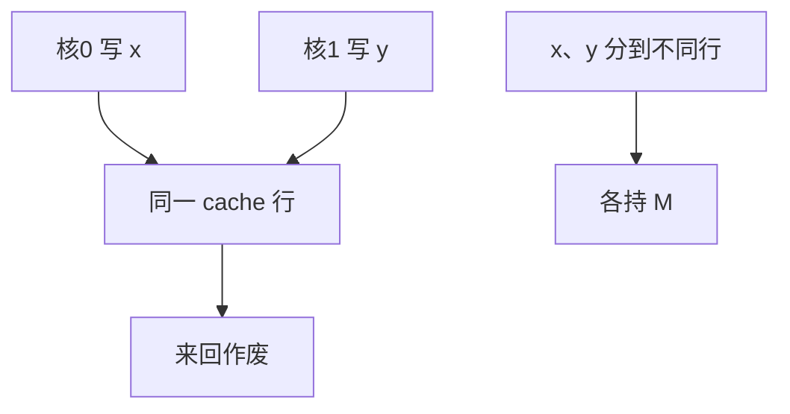

# 伪共享

两个核写的是不同变量，只要落在同一 cache 行，协议仍按真共享来回作废；程序员看见的是无锁计数器变慢，不是数据竞争。

<footer>—— 据 Bolosky and Scott；Hennessy and Patterson, CA:AQA 整理</footer>

[上一课](/cs/directory-scalability) 与 [MESI](/cs/mesi-protocol) 都按**行**维护副本。[行大小](/cs/line-size-sector) 越大，两个无关字段同行的概率越高。本课不重做目录 ack。缺口是把**伪共享（false sharing）**从「协议正确但性能崩」讲清楚：诊断是行颠簸，修复是对齐与填充，不是加目录。

## 问题

`stats[tid]++` 若 `stats` 是紧挨着的 4B 元素，核 0 与核 1 的计数器可能同行。每次 `++` 要 M，于是行在两核 L1 之间按 [MOESI](/cs/moesi-mesif) 飞。没有数据竞争：算法正确。缺口不是 fence，而是**共享粒度是行，不是 C 变量。**

真共享：同一地址被多核读写，语义就需要通信。伪共享：地址不同、行相同。填充到行对齐把它们拆开。

## 方法

诊断：PMU 上 LLC 写回/Snoop 命中对某数据段异常高，而代码无锁。修复：按行对齐每个核的热写字段；或线程局部再归约。结构体末尾 pad 到 64B。分区无法消除：配额再公平，inv 仍然发生。

## 机制

CPI 的一致性项可以压过 DRAM：cache-to-cache 延迟虽低于内存，频率极高时核空等。与 [存储集](/cs/store-set-predict) 无关：那是单核内 load/store 地址。伪共享是多核行所有权。压缩与扇区：扇区可以减少传输字节，但标签/目录仍可能按整行作废，假共享未必消失。

数组下标按 tid 紧挨递增是教科书陷阱；改成 `tid * (64/sizeof)` 或用 per-cpu 再归约。C++ 的 `alignas(64)` 只保证起始对齐，结构体后面的字段仍可能与别人同行。

## 边界

本课不把无锁算法的 ABA 当伪共享。也不把 OS 的 per-cpu 数据展开，只点名那是同一药方。下一课原子操作：真共享时硬件如何在行上做 RMW。

后课默认：无逻辑共享仍可能行共享。真共享的 `swap`/`cas` 要在 cache 协议上实现，不是只靠 ALU。

## 小结

- 伪共享是行粒度一致性对无关变量的惩罚；对齐/填充拆行。
- 协议无需修改，软件布局是主药。
- 原子 RMW 如何占住一行，是下一课。
- 出处：Bolosky and Scott；Hennessy and Patterson, *CA:AQA*。
