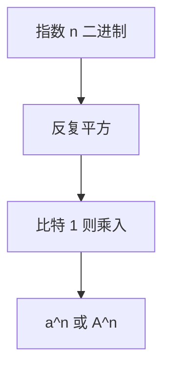

# 快速幂与矩阵幂

$a^n$ 用二进制平方：$n$ 的每一位对应一次乘；矩阵同法，线性递推第 $n$ 项因此 $\log n$ 次矩阵乘。

<footer>—— 据 Knuth, The Art of Computer Programming, 卷 2 半数值算法；CLRS 第 4、28 章整理</footer>

上一课[图流](/cs/graph-streaming)收束图进阶。本单元进入数值与代数。主干循环里 $n$ 次乘已会。缺口是**指数的对数次乘法**：平方–乘。矩阵幂把常系数线性递推送到 $\Theta(\log n)$ 次 $k\times k$ 乘。不重写主定理。后课高精度再谈大整数本身。

## 问题

标量 $a^n$：写 $n=\sum b_i 2^i$，维护 $a^{2^i}$ 平方，遇 $b_i=1$ 乘入答案。$O(\log n)$ 次乘。模 $m$ 时每次模，接[模运算](/cs/modular-arithmetic)。矩阵 $A^n$ 同形，乘法换成矩阵乘 $O(k^\omega)$。线性递推 $f_n=a_1 f_{n-1}+\cdots+a_k f_{n-k}$ 伴生矩阵 $k\times k$，第 $n$ 项在 $A^{n}$ 里。

缺口是结合律下的平方，不是 FFT（后课）。

### 不是浮点 $e^{n\ln a}$

浮点指数有精度与溢出。离散、矩阵、模意义下必须平方–乘。负指数在模下用逆，[扩欧](/cs/euclid-extended) 已给。

Knuth TAOCP 卷 2 讨论幂。矩阵形式是线性代数课标准。后课 Karatsuba/FFT 加速的是「一次乘」，本课减的是乘的次数。

## 方法

递归或迭代平方。注意 $n=0$。矩阵先写对乘法。模幂勿中间溢出。

斐波那契 $k=2$ 是课堂例子，不另开算法。

## 机制

结合律保证 $(A^2)^{n/2}=A^n$。与树上倍增同一二进制分解，对象换成半群。非结合运算不能乱平方。半环上最短路矩阵幂是 Floyd 另一叙述，本课点名不写。

## 边界

本课不写快速矩阵乘的 $\omega$ 历史（Strassen 后课）。不写离散对数（后课 BSGS）。后课默认：$a^n$ 与 $A^n$ 皆 $O(\log n)$ 次乘。下一课高精度算术。

## 小结

- 平方–乘 $O(\log n)$ 次乘。
- 线性递推 = 伴生矩阵幂。
- 模下每次取模；浮点指数不是同一问题。
- 出处：Knuth TAOCP 卷 2；CLRS。
