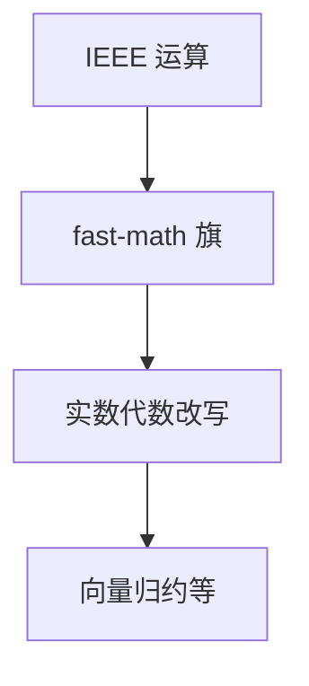

# fast-math

IEEE 754 不承认实数的全部代数：结合律、`0*x`、NaN。fast-math 显式允许编译器按实数代数改写，换速度，丢位模式与异常。

<footer>—— 据 IEEE 754；Goldberg, What Every Computer Scientist Should Know About Floating-Point Arithmetic；GCC/LLVM `-ffast-math` 文档整理</footer>

上一课[UB 与优化](/cs/undefined-behavior-opt)是整数与指针契约。缺口是**浮点**：默认须保持 IEEE（除语言另有规定）。fast-math：允许重结合、忽略 NaN/Inf 的某些路径、把 `x+0` 当 `x`（符号零例外被抹掉）。中端课序在此结束：标量/循环优化的合法性两扇门——UB 与浮点旗。下一单元后端分配。

## 问题

向量化归约、多面体并行求和，都想重结合。IEEE 不许。旗打开则 LICM/CSE 可把 `x*2+x*2` 变 `x*4` 一类。缺口是**旗是合同变更**，不是「更聪明的 GVN」。

`fma` 融合改变舍入，有的旗允许。与[组成课浮点](/cs/fp-exceptions) 的异常标志：fast-math 可假定不看状态字。

### fast-math 不是 UB

程序仍有定义行为，只是数学上不是 IEEE 的那一个。调试：同一源两种旗结果不同是预期。不要当编译器 bug 开单（除非旗未开却重结合）。

Goldberg 1991。IEEE 754。GCC `-ffast-math` 拆成 `ffinite-math-only` 等。本课不把神经网络训练的混合精度当本栏主题。

## 方法

IR 指令带 `nnan`/`ninf`/`reassoc`/`contract`。变换检查旗。库：`sin` 可换成近似。报告：优化备注说明因哪一旗启用。

与 PGO：热循环更可能值得开；但旗是编译单元级，不是轮廓自动开。

## 机制

符号零、NaN payload、比较的谓词（`NaN != NaN`）都会被改。数值代码（Kahan 求和）必须关旗。不要全局 `CFLAGS=-ffast-math` 灌进内核。

语言：Fortran 传统上更允许重结合；C 默认不允许。对照用。

## 边界

本课不写全部 IEEE 模式。后课默认：无旗则保持浮点语义；有旗才重结合。下一课线性扫描寄存器分配：后端开始，假定 IR 已合法化。

也不把 fast-math 当定点数。

## 小结

- fast-math 显式放弃部分 IEEE，换代数与 SIMD 归约。
- 与 UB 不同：仍有定义，只是另一种定义。
- 数值稳定代码应关闭。
- 出处：IEEE 754；Goldberg, 1991；GCC/LLVM 旗文档。
