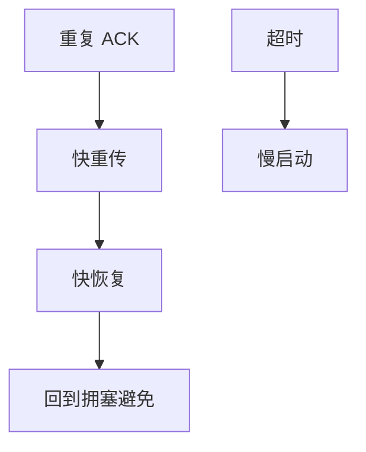

# 快速重传与恢复

三个重复 ACK 推断丢包并立刻重传，快恢复用减半后的窗口继续发，避免慢启动把管道抽空。

<footer>—— 据 RFC 5681；Jacobson, 1988；主干 Reno 课整理</footer>

[上一课](/cs/aimd-dynamics) 给出减半几何。主干[序号与重传](/cs/tcp-seq-rexmit)、[SACK](/cs/tcp-sack) 已有。缺口是**快重传/快恢复与超时的分工**：dupACK 计数、inflate 窗口、incast 短流为何仍只能等 RTO。本课不把 BDP 公式写完。

## 问题

超时把 ssthresh 记下再把 cwnd 抽到很小。若只丢一包且后续包仍到，收端每包回 dupACK。满三个：重传丢失包，进入快恢复：cwnd ≈ FlightSize/2，每额外 dupACK 可再发新数据（Reno inflate）。SACK 让恢复知道洞在哪，避免重传已到的段。三个 dupACK 要管道里还有包，BDP 太小或短流则失败——incast 场景。

不要把快重传写成「永远不必超时」。

RFC 5681。NewReno 修部分 ACK。本课不把每家内核的 RACK 写完，后课可点名。

### 三个 dupACK 才走快路径

快恢复避免抽空管道。短流/浅管道仍可能只能 RTO。乱序会产生伪 dupACK。SACK 告诉洞在哪。

## 方法

对照：RTO 路径 vs 快重传路径。画：dupACK++ → 3 → 重传 → 快恢复 → 新 ACK 退出。与 DCTCP：标记不走这条丢包路径。

方法止于选定对象与对照；机制才说它如何嵌入已有分层与主干课。

## 机制

AIMD 的 MD 在快恢复里发生，不是在慢启动。ECMP 乱序会产生伪 dupACK，要用 FACK/RACK 或乱序阈。RoCE 无这条状态机。卫星误码触发假拥塞 MD，RFC 2488 的痛。

SACK 是信息，快恢复是控制；两者配套。

## 边界

本课不引入 BBR 探测的全部。带宽时延积是下一课。后课默认：三个 dupACK 走快路径；否则 RTO。

重复 ACK 阈固定为 3 是历史折中，不是信息论最优。

上一课留下的缺口在本课收口；「快速重传与恢复」进入后课词汇表后只引用。文献用来钉对象与边界，不把本课写成该主题的独立综述。下一课[带宽时延积](/cs/bandwidth-delay-product)。

## 小结

- 快重传用 dupACK 推断丢包。
- 快恢复避免抽空管道。
- 短流/浅管道仍可能只能 RTO。
- 后课只引用本课钉死的对象，不从该领域总问题重开。
- 出处：RFC 5681；Jacobson, 1988。
