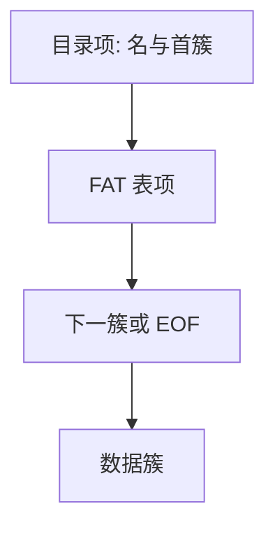

# FAT 与目录项

文件分配表把簇号当成链表结点：目录项只记下起始簇，其余块号全在那张表里。

<footer>—— 据 Microsoft FAT 规范；Arpaci-Dusseau, <em>OSTEP</em> 对 FAT 作为简单布局的整理</footer>

[上一课](/cs/bootstrapping)把编译进阶收到自举链。操作系统主干已经有 [VFS](/cs/vfs)、[inode](/cs/inode-dir)、[页缓存](/cs/page-cache) 与 [ext4 日志](/cs/ext4-journal)。进阶课不从「什么是文件」重讲，缺口是**盘上第一种可指着读的布局**：FAT。后课默认已经读完本课的簇链与目录项。

## 问题

Unix inode 把块指针放进对象本身；FAT 把几乎所有「下一簇」指针抽到卷头附近的一张表。目录项是定长记录：短名、属性、起始簇、文件大小。没有独立 inode 号，硬链接不是一等公民。缺口不是再写 [字节流](/cs/file-bytestream)，而是：打开一个名字之后，内核如何只靠「起始簇 + FAT 数组」把逻辑偏移译成盘上簇。

本课不把 exFAT 的位图与目录哈希写成另一套百科。

FAT12/16/32 的差别主要是表项位宽与根目录是否也走簇链。教学对象是同一张表：空闲、坏簇、EOF、下一簇号。

## 方法

卷：保留扇区（含 BPB）、FAT 的一份或两份副本、（FAT16 的）固定根目录区、数据区按簇编号。读文件：从目录项取首簇，沿 FAT 走到 EOF，中间簇按偏移取模。写：在 FAT 上找空闲项，链到尾，回写目录项的大小。删除：目录项标空闲，把簇链标空闲——回收与「名字消失」是两步，中间崩溃会泄漏簇。

## 机制

FAT 把元数据局部性做成「一张可缓存的数组」：簇分配不必扫整盘，但大文件的随机读要跳链，碎片使链变长。根目录在 FAT16 上是特殊文件，子目录只是属性为目录的普通簇链，里面仍是目录项。短名 8.3；长名靠 VFAT 槽拼出来，本课只承认它仍是目录项的编码，不是 inode。

对照主干：[inode](/cs/inode-dir) 的直接/间接指针把「文件自己的块图」留在对象旁；FAT 把块图做成全局表。VFS 仍然看见 inode——Linux 给每个目录项造一个内存 inode，编号往往由簇号与槽位拼出来，盘上并没有 Unix inode 表。

不要把本课写成数据库栏的堆文件：这里没有元组，只有簇与目录记录。

实现上：簇大小一旦在格式化时钉死，小文件就会把整簇算进占用；这是 FAT 在闪存上仍然「看起来满」的来源。Linux vfat 用目录槽合成 inode 号，所以在同一目录里移动槽位会让号变，NFS 导出 FAT 因此发脆。 读法上只引用[上一课](/cs/bootstrapping)的结论，不把对象换成训练推理或限价簿。

本课在操作系统进阶的「文件系统实现 / 布局与日志」课序里，对象是 **FAT 与目录项**。

- 先修只引用，不重导：上一课的结论当公理，本课只补差。
- 五栏不吞并：不把本课写成大模型训练/推理，也不写成限价簿或权重量化。
- 文献用 OSTEP、McKusick、内核文档与具名会议论文；不发明 arXiv 编号。

## 边界

版本字段会变，课序钉的是机制对象「FAT 与目录项」，不是某一主线内核的结构体名。本课不引入块组、位图、extent。不保证 U 盘拔出等于干净卸载：FAT 常无日志，`fsck` 要扫表与目录。下一课用 ext2 说明另一条路：把空闲信息与 inode 表切成块组，而不是一张全局 FAT。

后课默认：簇链 + 目录项足以实现一种真实文件系统。块组如何切盘、位图如何代替 FAT 数组，下一课 ext2。

## 小结

- FAT 用全局表串簇；目录项只存名、属性、首簇与大小。
- 内存里仍可有 VFS inode，盘上没有 Unix inode 表。
- 块组与位图是下一课的缺口。
- 出处：Microsoft FAT Specification；Arpaci-Dusseau, *OSTEP*；McKusick 对 FFS 对照的背景。
