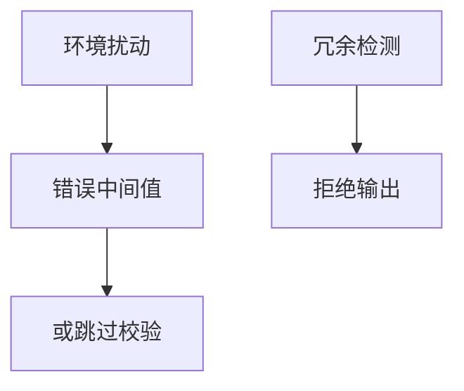

# 故障注入

电压、时钟或激光让芯片算错一轮，错误输出可能泄漏密钥或跳过校验。防护是冗余、检测与失败即关，而不是假设封装等于物理不可及。

<footer>—— Boneh, DeMillo and Lipton, On the Importance of Checking Cryptographic Protocols for Faults, EUROCRYPT 1997</footer>

## 定位

上一课[DPA](/cs/power-analysis-dpa)是被动观测。缺口是**主动让计算出错**。本课讲故障与检测，不给注入实验步骤。

后课默认已经读完本课钉下的合同，只补差，不从该领域第一性原理重开。

## 问题

RSA CRT 一类实现在错误输出下可泄漏因子——只陈述「要验证计算结果」。缺口是冗余与传感器。

### 安全元件

认证实验室测故障。软件栈不能假设芯片无故障。

Boneh–DeMillo–Lipton。禁止故障注入实验指导。PUF 下一课把物理不可克隆当身份。

## 方法

对照被动/主动物理。对策：重复计算、校验、故障传感器。下一课 PUF。

图中节点是本课的机制骨架；课程不把图展开成可运行的攻击步骤。

## 机制

完整在物理层：计算必须自检。PUF 用物理差异当指纹，模型不同。

前提写进合同之后，游戏外的误用只当失败模式点名，不在本课写成操作程序。

## 边界

零实验配方。PUF 下一课。

## 小结

- DPA 被动；故障主动改计算。
- 错误输出可伤密钥；要校验。
- 封装不是物理不可及证明。
- 下一课 PUF。
- 出处：Boneh, DeMillo and Lipton, 1997。
