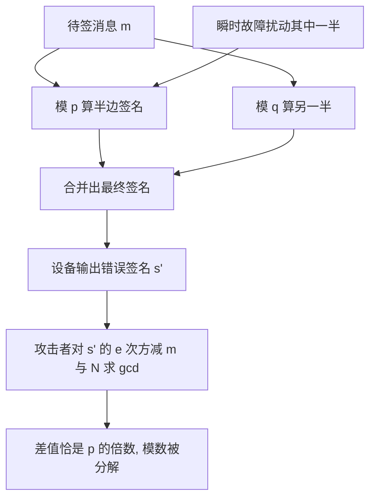
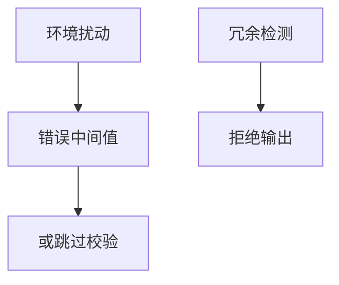

# 故障注入

电压、时钟或激光让芯片算错一轮，错误输出可能泄漏密钥或跳过校验。防护是冗余、检测与失败即关，而不是假设封装等于物理不可及。

<footer>—— Boneh, DeMillo and Lipton, On the Importance of Checking Cryptographic Protocols for Faults, EUROCRYPT 1997</footer>

上一课[DPA](/cs/power-analysis-dpa)是被动观测功耗；缺口升级为**主动让计算出错**——注入电压毛刺、时钟扰动或激光，看错误输出能换来什么。本课讲故障与检测，不给注入实验步骤。

后课默认已经读完本课钉下的合同，只补差，不从该领域第一性原理重开。

## 问题

经典失败模式是 RSA-CRT：签名分模 $p$、模 $q$ 两半各算再合并，若某一半被瞬时故障扰动，错误签名与正确结果之差就是 $p$（或 $q$）的倍数，一次 gcd 即分解模数——这是 Boneh–DeMillo–Lipton 的结论。教训不是「运气差」，而是不信任自己的计算：缺口是冗余设计与故障传感器。

```mermaid
flowchart TD
  M["待签消息 m"] --> H1["模 p 算半边签名"]
  M --> H2["模 q 算另一半"]
  FA["瞬时故障扰动其中一半"] --> H1
  H1 --> C["合并出最终签名"]
  H2 --> C
  C --> BAD["设备输出错误签名 s'"]
  BAD --> G["攻击者对 s' 的 e 次方减 m 与 N 求 gcd"]
  G --> F["差值恰是 p 的倍数, 模数被分解"]
```

术语翻译：CRT（中国剩余定理）在这里就是把一个大数运算拆成模 $p$、模 $q$ 两个小数各算一遍再合并，速度约快 4 倍。数字实例：2048 位的 $N$ 拆成两个 1024 位的半边——模乘代价与位数近似立方相关，位数减半，每边只剩约八分之一的工作量。

### 安全元件

安全元件认证会把故障注入交给认证实验室实测；软件栈拿到芯片后不能反过来假设它无故障——故障是概率性的，任何一次会话都可能碰上一次成功扰动。

Boneh–DeMillo–Lipton。禁止故障注入实验指导。PUF 下一课把物理不可克隆当身份。

## 方法

方法先把被动与主动分开：被动读泄漏，主动改状态。对策相应三件——关键运算重复一遍或双通道并行再比对（时间/空间冗余）、输出前校验（CRT 结果代回验证，开销小得多）、电压与时钟传感器发现环境异常即拒绝输出或清密钥。下一课 PUF。

```mermaid
flowchart TD
  FAULT["环境扰动"] --> ERR["错误中间值"]
  ERR --> LEAK["或跳过校验"]
  CHK["冗余检测"] --> FAIL["拒绝输出"]
```

## 机制

机制上完整性落到了物理层：密码学正确性证明默认「运算按规范执行」，故障注入破坏的正是这条前提，防线只能是计算自检——把「我真算对了吗」变成每次输出前的可执行检查。下一课 PUF 同属物理轴但模型不同：故障注入让物理干扰计算，PUF 把物理差异本身当资产。

直觉类比：CRT 代回校验就像考试做完把答案代回题目验算——只花一步乘法，比重考一遍（整个签名重算）便宜得多。这也是三件对策里开销排序的直觉：代回校验最便宜，重复计算最贵，传感器防的是环境而非算错。

为什么重要：如果输出前不做校验，一次毛刺就可能把私钥的因子直接送到攻击者手里——不是「这次签名不对」的小问题，而是密钥当场作废级别的事故。安全工程师把「输出前验证」当成硬性 checklist 项，原因就在这里。

## 边界

零实验配方；边界要点名：冗余不是万能——攻击者可以两次注入相同的故障骗过比对，校验逻辑自身也要进威胁模型。PUF 下一课。

常见误区：初学者容易以为「算两遍再比对」就万无一失。实际上比对能拦住随机故障，拦不住刻意构造的相同故障——两遍被同一毛刺打歪，结果照样一致地错。所以校验电路本身也得有冗余或屏蔽，否则它就是整条防线的单点。

## 小结

- DPA 被动；故障主动改计算。
- 错误输出可伤密钥；要校验。
- 封装不是物理不可及证明。
- 下一课 PUF。
- 出处：Boneh, DeMillo and Lipton, 1997。
