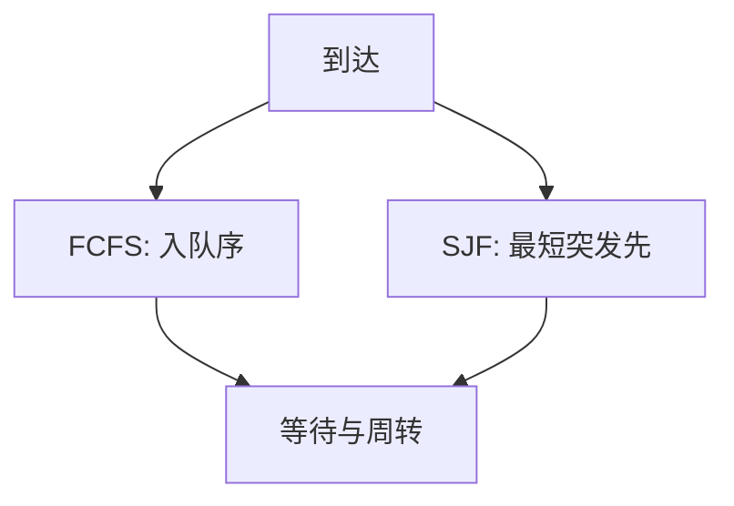

# FCFS 与 SJF

先来先服务实现最直；短作业优先降低平均等待，但要知道或估计下一次 CPU 突发有多长。

<footer>—— 据 Silberschatz et al., Operating System Concepts 整理</footer>

[上一课](/cs/runqueue)给出可运行容器。[调度指标](/cs/scheduling-metrics)已警告：换尺子，名次就换。缺口是两条经典**非抢占**（SJF 可做成抢占的 SRTF）策略：FCFS 按入队序；SJF 按下一次突发最短者先跑。本课对着同一组到达与突发比较，不引入时间片。

## 问题

FCFS：runqueue 当 FIFO，实现即入队出队。长 CPU 型先到，后面一串 I/O 型的等待被拖长，即传送带效应。SJF：选估计突发最短的，平均等待往往更优；证明「非抢占 SJF 平均等待最优」教材可引，本课只锁定直觉与代价——**长度未知**。缺口不是新的队列结构，而是用指标解释这两种取队头的规则。

抢占式最短剩余时间（SRTF）在新短作业到达时打断当前长作业，响应更好，切换更多。估计常用指数平均：最近突发与历史的凸组合。

## 方法

给定到达时间与突发，画出甘特图，算平均等待与周转。FCFS 不需要估计。SJF 需要预言或估计；估计偏长则退化成近 FCFS，偏短则可能饿死长作业——饥饿是公平尺子，不是平均等待。本课点名饥饿，不把多级反馈请进来。

两者默认跑到突发结束（阻塞或结束）才再选，除非用 SRTF。

## 机制

FCFS 对 I/O 型不友好当它排在长计算后面；SJF 照顾 I/O 型（短突发）从而抬利用率。交互响应仍可能差：一个中等突发也能挡住击键，因为没有时间片上限。这把下一课轮转的动机钉在「即使长度未知，也要定期让出」。

## 边界

本课不把实时截止当成短作业。也不把 SJF 说成 Linux 默认。估计误差与恶意谎报长度（用户说自己很短）在开放系统里存在；内核若用实测突发，谎报无效。

后课默认：非抢占策略平均等待可以很好，响应仍可很差。定期抢占的时间片轮转，下一课收。

## 小结

- FCFS 简单，有传送带效应；SJF 降平均等待，依赖估计，可饿死长作业。
- 两者都不自动给出交互响应上限。
- 时间片轮转是下一课。
- 出处：Silberschatz et al., *OSC*；Tanenbaum and Bos, *MOS*。
