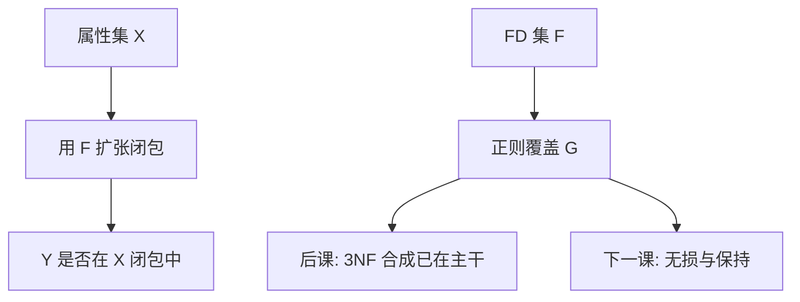

# 闭包与最小覆盖

属性闭包用 FD 当产生式扩张；正则覆盖去掉冗余依赖与多余属性，3NF 合成吃的就是这一份最小合同。

<footer>—— 据 Bernstein 合成算法；Ramakrishnan and Gehrke；Ullman 对闭包与覆盖的整理</footer>

[上一课](/cs/armstrong-axioms)给出 FD 的可靠完备公理。本课不重推三条。缺口是算法：给定 $F$ 与 $X$，是否 $X \to Y$？给定 $F$，有没有更小的 $G$ 与 $F$ 等价？主干 3NF 合成「按正则覆盖建表」，进阶把闭包与最小覆盖写清。

## 问题

$X^+$：从 $X$ 出发，反复把已被决定的属性并进来，直到不动。$Y \subseteq X^+$ 当且仅当 $F \models X \to Y$。这是蕴含的决策过程，复杂度对 $|F|$ 与属性数多项式。缺口还包括覆盖：若 $F$ 与 $G$ 蕴含相同依赖，则等价。最小（正则）覆盖：右部单属性、无多余 FD、无左部多余属性。

多余：一条 FD 可被其余推出则删。左部多余属性：从左部拿掉仍蕴含原 FD。求正则覆盖是 3NF 合成的预处理，否则会建出多余表或漏表。

闭包也可对整个 $F$ 谈 $F^+$（所有被蕴含的 FD），那是指数大的集合，不能枚举；算法永远用属性闭包当探针，不物化 $F^+$。

## 方法

属性闭包：结果集 $Z \leftarrow X$；扫描 $F$，若左部 $\subseteq Z$ 则 $Z \leftarrow Z \cup$ 右部；重复至不变。实现可用计数器避免每轮全扫。候选键：找 $X \subseteq U$ 使 $X^+ = U$ 且真子集不行——枚举子集仍指数，但属性少时可行；启发式从决定因素入手。

正则覆盖：先拆右部为单属性；删多余 FD；对每条左部试删属性并用闭包检验。结果不唯一，但都与 $F$ 等价。

## 机制

BCNF 检验：对覆盖中每条 $X \to A$，检查 $X$ 是否超键（$X^+ = U$）。3NF：允许 $A$ 为主属性的例外。这些判定都把本课当子程序。查询优化不用闭包搜连接顺序；依赖理论站在模式层，与 Selinger 课分开。

错误的覆盖（漏 FD）会让分解看起来已保持依赖，运行时却出现违反——约束课的运行时检查补的是实例，不是 $F$ 写错。

## 边界

本课不证明 3NF 合成的正确性定理全文，不引入无损连接判定的tableau——下一课。也不对 SQL 唯一约束如何近似 FD 再展开。

后课默认：$F$ 以正则覆盖呈现；键用闭包检验。无损分解与依赖保持是分解质量的两条独立轴。

闭包是探针；覆盖是合同的最简写法。二者都比「列出 $F^+$」可算。

## 小结

- 属性闭包判定 FD 蕴含；正则覆盖与 $F$ 等价且无多余。
- 3NF/BCNF 检验把闭包当子程序。
- 下一课：分解何时无损、何时保持依赖。
- 出处：Bernstein；Ullman；Ramakrishnan and Gehrke。
