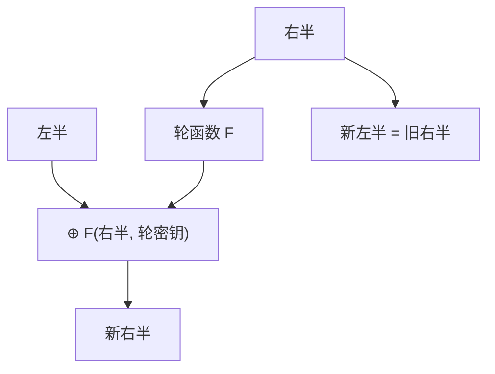

# Feistel 与 DES 对照

Feistel 把块分成两半，一轮只用一边做轮函数再交叉；即使轮函数可逆性弱，整圈置换仍可逆。DES 是它的历史实例，块太小，今日不当新设计的默认。

<footer>—— Feistel, Cryptography and Computer Privacy, Scientific American, 1973；NIST FIPS 46-3（历史）</footer>

## 定位

上一课[AES](/cs/aes-structure)是代换–置换网络。缺口是**另一族结构**：Feistel，以及为何 DES 退出主干。[DH 与 RSA 分工](/cs/dh-vs-rsa)不在这里重写；本课只对照块密码骨架。

后课默认已经读完本课钉下的合同，只补差，不从该领域第一性原理重开。

## 问题

AES 每圈都要 MixColumns 这类可逆线性层。Feistel：$R'=L\oplus F(R,k_i)$，$L'=R$，解密即倒圈。DES：64 比特块、56 比特有效密钥，8 个 S 盒。缺口是结构对照与参数过时：生日界下 64 比特块在大量数据下碰撞；56 比特密钥可穷举。3DES 是权宜，不是目标。

### 不教破解步骤

本课不给差分分析或穷举的操作序列。只需：块小、密钥短是规格失败，换 AES/ChaCha，不要「加奇异 S 盒」当创新。

Luby–Rackoff：足够独立的伪随机轮函数可把 Feistel 做成 PRP。DES 的实际轮函数不是理想对象；分析史说明余量不够今日。

## 方法

画三圈 Feistel 的交叉。对照 AES：无需把 F 做成可逆。列出 DES 的参数缺陷。指出许多「类 DES」只换 S 盒仍继承 64 比特块。

图中节点是本课的机制骨架；课程不把图展开成可运行的攻击步骤。

## 机制

Feistel 把可逆性从 F 上卸走，实现友好。安全仍取决于 F 的混乱与扩散以及圈数。DES 作为历史对照：能讲清「为何要换」，不能当新协议的分组密码。后课流密码 ChaCha 走另一条路：不分组，直接造 PRG 式的密钥流。

前提写进合同之后，游戏外的误用只当失败模式点名，不在本课写成操作程序。

## 边界

本课不把 3DES 的 EDE 细节写成推荐。不要在新系统里启用 DES。下一课 ChaCha20：ARX 软件流密码，对照 AES 的硬件友好 SPN。

## 小结

- AES 是 SPN；Feistel 用交叉使整圈可逆。
- DES 块 64、密钥 56，规格上已退出默认。
- Luby–Rackoff 说明理想轮函数下 Feistel 可成 PRP。
- ChaCha20 是下一条软件向密钥流。
- 出处：Feistel, 1973；FIPS 46；Luby and Rackoff；对照 FIPS 197。
