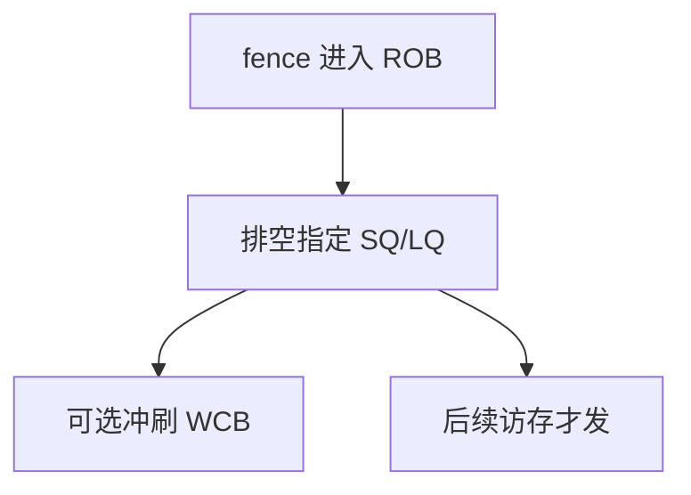

# fence 的代价

全序栅栏要排空写缓冲、禁止越过它的 load 提前，等于主动关掉乱序与 MLP；正确的程序少用，用错的程序把它当注释重复插。

<footer>—— 据 Hennessy and Patterson, CA:AQA；Intel SDM 对 mfence/sfence/lfence 的描述 整理</footer>

[上一课](/cs/transactional-memory) 用 abort 代替部分锁。[acquire/release](/cs/acquire-release) 已经是单向的。程序员和编译器仍会放出 `fence` / `mfence` / `dmb`。本课不重画写集。缺口是**把栅栏换成流水线里的停顿：SQ drain、load 禁止提前、甚至指令串行化**，并收束本单元。

## 问题

弱序核上，没有栅栏则 [LSQ](/cs/lsq-disambiguation) 可以让年轻 load 越过年长 store（地址不同时）。设备驱动、无锁、与 GPU 共享的页需要更强顺序。缺口不是新一致性态，而是**fence 在微结构上等于什么，以及它如何毁掉 [MLP](/cs/mlp-memory-parallelism) 与 store 缓冲。**

x86：`sfence` 主要排 store；`lfence` 阻止后续指令在先前 load 前执行；`mfence` 更强。RISC-V `fence rw,rw` 的前/后集合可配，不必每次全排空。

## 方法

实现：fence 在 ROB 里占一项，直到指定集合里更年长的访存完成一致性动作（store 成为 M 可见、load 数据已返回）。更年轻的同类型访存不得越过。可选：冲刷 [写合并](/cs/write-combining)。串行化 fence（如 `cpuid` 一类）还要等整个 ROB 退休。

## 机制

代价以「本可以飞行的 miss 被拦住」计，不是 ALU 的一拍。高争用锁若每层都 seq-cst，会把核变成近似顺序机。[CPI 与阿姆达尔](/cs/cpi-amdahl) 在这里极狠：一小段同步代码的 $f$ 被放大。正确用法是：数据竞争自由的程序把 fence 藏进锁/原子原语，而不是散落在每个共享读。

本单元收束：替换、预取、VIPT、一致性五态与目录、伪共享、原子、模型、事务、fence。下一单元从并行分类（Flynn）转向向量、SIMT 与互连，不再加宽单核 cache 协议。

## 边界

本课不把所有 ISA fence 的真值表抄完。也不把 Spectre 的 `lfence` 串行化当性能优化推荐——那是后课安全与推测，动机相反。Flynn 分类下一课从「单核 ILP」抬到「多指令多数据怎么摆」。

后课默认：fence 是主动放弃 ILP/MLP 换顺序。并行形态先按 Flynn 分箱，再谈 VLIW 与 GPU。

## 小结

- fence 排空指定访存集合，代价是 MLP 与写缓冲。
- 能用 acquire/release 就不要用全序。
- 下一课序从 Flynn 分类开始谈并行形态。
- 出处：Hennessy and Patterson, *CA:AQA*；Intel SDM；RISC-V 内存模型。
