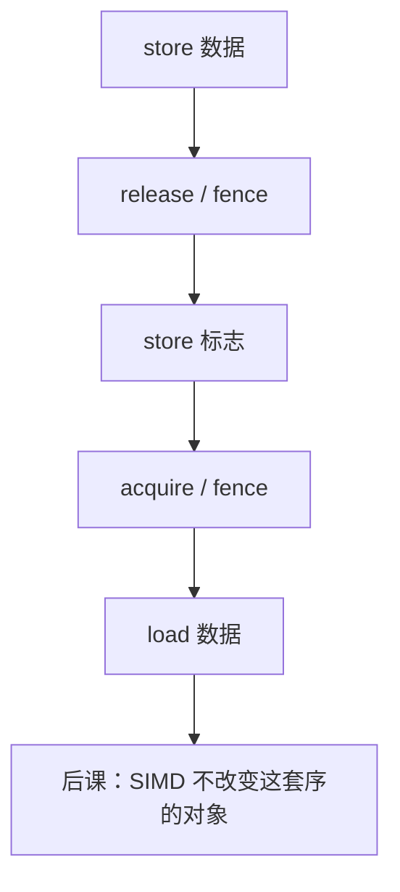

# 内存序指令 fence

  
弱序机器上，store 后面的 load 可以先执行；fence 告诉硬件哪些程序序必须变成对其他核可见的序，原子指令的 acquire/release 是它的特化。

  <footer>—— 据 The RISC-V Instruction Set Manual；ARM ARM；Intel SDM；Adve and Gharachorloo, Shared Memory Consistency Models, IEEE Computer 1996 整理</footer>

[上一课](/cs/lr-sc-cas)给出 RMW。[DMA](/cs/dma-scatter-gather) 要求描述符写对设备可见。[持久内存](/cs/nvm-persistent) 还要冲刷。缺口是 CPU 之间的 **内存一致性模型与 fence**：x86 近似 TSO，ARM/RISC-V 更弱。

## 问题

乱序核与写缓冲让独立地址的访问重排。若核0 store 数据再 store 就绪标志，核1 load 标志再 load 数据，弱序上可能看见新标志旧数据。fence（RISC-V `fence`，ARM `dmb`/`dsb`，x86 `mfence`/`sfence`/`lfence` 及 `lock` 副作用）切开。缺口不是 CAS 循环写法，而是**哪些重排被禁止**。

TSO（x86）：允许 store-load 重排为主，程序员少插 fence；仍要 `mfence` 于少数模式。ARM/RV：要显式 acquire/release 或 fence。C/C++ 的 `memory_order` 降到这些指令。

### fence 不是「刷新 cache」

它不把缓存丢掉，而是约束提交与可见性序。`clflush` 才冲缓存行（持久与 DMA 有时要）。把 `fence` 当 `wbinvd`，性能与语义都错。设备 MMIO 往往需要更强的 I/O 围栏，以防写缓冲合并门铃。

Adve/Gharachorloo 1996 是模型综述。RISC-V 手册第 14 章一类（版本因手册而变）描述 fence 前趋。ARM ARM 的 barrier。Intel SDM 的 MFENCE。本课不发明论文号。

## 方法

生产者：写 payload，`release` store 或 `fence rw,w` 再写 flag。消费者：读 flag，`acquire` 或 `fence r,rw` 再读 payload。RISC-V `fence.i` 管指令缓存，是另一条（自修改代码）。PCIe DMA：写描述符后可能要 store-release 再写门铃 MMIO。

与单核：编译器重排也要编译器屏障；本课偏硬件指令。

## 机制

下一课 SIMD 并行的是数据通路，内存序仍按标量模型作用于每条向量访存（实现可更宽）。RVV 的向量 load 同样受 fence 约束。本课把 ISA 对照从「运算」接到「多核可见性」。

## 边界

本课不把 C++ 标准逐条背完，不证明 RCpc vs RCsc。不写 GPU 的 `__threadfence`。不进入 JVM 内存模型全书。

后课默认：弱序 ISA 用 fence/acquire-release 配对生产者消费者；x86 TSO 更强但仍非顺序一致。下一课 SIMD 扩展。

## 小结

- 弱序允许重排；fence 切开可见性。
- 不是冲缓存；DMA/MMIO 常需更强序。
- x86 TSO vs ARM/RV 弱序决定 fence 密度。
- 出处：RISC-V ISA；ARM ARM；Intel SDM；Adve and Gharachorloo, 1996。
