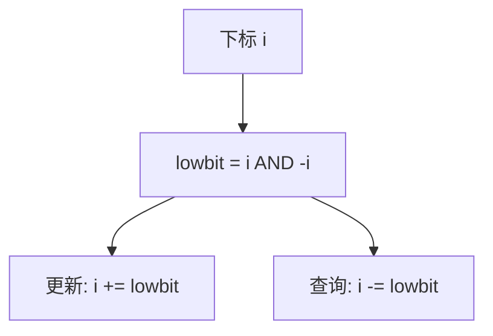

# 树状数组

每个下标负责一段以自己为右端、长度为最低位 1 的前缀碎片；改一点只走祖先，问前缀只走低位清零。

<footer>—— 据 Fenwick, A New Data Structure for Cumulative Frequency Tables, Software: Practice and Experience, 1994；Cormen, Leiserson, Rivest and Stein 整理</footer>

[上一课](/cs/sparse-table)把静态幂等查询钉成 $O(1)$，数组一改就整表作废。[前缀和](/cs/prefix-sum-difference)同样经不起单点修改。本课不重讲倍增窗口。缺口是：**可更新的前缀和**——树状数组（Fenwick / binary indexed tree），单点加与前缀和都是 $O(\log n)$。

## 问题

需要维护 $A[1..n]$，操作是 $A[i]\mathrel{+}=d$ 以及查询 $S[r]=\sum_{i=1}^{r}A[i]$。线段树也能做，但节点数约 $4n$、常数更大。Fenwick 用 $n$ 个格子：下标 $i$ 存 $\sum A$ 在区间 $(i-\mathrm{lowbit}(i),i]$ 上的和，其中 $\mathrm{lowbit}(i)=i\,\&\,{-i}$。缺口不是新的群，仍是加法；是**用二进制进位结构代替递归线段**。

区间和仍是 $S[r]-S[l-1]$。区间加可再套一层差分，本课先钉点修前缀查。

lowbit 来自补码：$-i=\sim i+1$，与 $i$ 只在最低的 1 及其右侧为零处相交。

## 方法

更新 $i$：当 $i\le n$ 时把 $C[i]$ 加上 $d$，再 $i\mathrel{+}=\mathrm{lowbit}(i)$。查询前缀 $r$：累加 $C[r]$，再 $r\mathrel{-}=\mathrm{lowbit}(r)$，直到 $0$。两次都 $O(\log n)$ 步。下标从 $1$ 起；不要用 $0$，lowbit 会停住。

初始化可逐点更新 $\Theta(n\log n)$，或按 $A$ 扫一遍把贡献加到 $C[i]$ 再向上，$O(n)$。

## 机制

每个 $A[j]$ 出现在哪些 $C[i]$：所有 $i\ge j$ 且 $(i-\mathrm{lowbit}(i),i]$ 盖住 $j$ 的那些。沿 $i\mathrel{+}=\mathrm{lowbit}$ 恰好走完覆盖 $j$ 的祖先。查询沿清低位走的是一段段不相交、并起来等于 $[1,r]$ 的块。

空间 $\Theta(n)$，比线段树瘦。缓存：跳 $\mathrm{lowbit}$ 比连续扫跳得散，但步数只有 $\log n$。二维 Fenwick 同构嵌套，本课不展开。

与[数组随机访问](/cs/array-random-access)：$C$ 仍是数组，只是语义按二进制区间切。

## 边界

运算须可结合、通常要可逆（区间用两个前缀）。最值也可以做，但「单点改成任意值」比「只加」麻烦，实践多换线段树。本课不写树上差分、不写权值树状数组套主席树。

后课默认：点修前缀和用 Fenwick 即可。要任意结合律、区间改、或存整段懒更新，下一课线段树。

## 小结

- Fenwick：lowbit 切前缀碎片，点修与前缀查询 $O(\log n)$。
- 空间 $n$；下标从 1。
- 更一般的区间运算交给线段树。
- 出处：Fenwick, *Software: Practice and Experience*, 1994；Cormen et al.。
