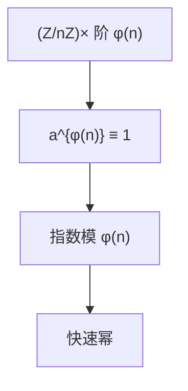

# 费马与欧拉定理

$p$ 素数、$p\nmid a$ 则 $a^{p-1}\equiv 1\pmod p$；一般 $n$，$\gcd(a,n)=1$ 则 $a^{\varphi(n)}\equiv 1\pmod n$。模幂的指数可先模 $\varphi(n)$。

<footer>—— 据 Fermat；Euler；Ireland and Rosen, A Classical Introduction to Modern Number Theory 整理</footer>

上一课[扩展欧几里得](/cs/euclid-extended) 给出逆。缺口是**乘法阶**：逆也可以写成 $a^{\varphi(n)-1}$，更重要的是把 $a^k$ 的指数降到模 $\varphi(n)$。RSA 明文运算依赖 $a^{ed}\equiv a\pmod n$ 的欧拉（或 Carmichael）形式。本课不讲 RSA 协议。

## 问题

$\varphi(n)=|(\mathbb{Z}/n\mathbb{Z})^\times|$。群论：有限群 $x^{|G|}=1$。欧拉定理即此。费马是 $n=p$，$\varphi(p)=p-1$。$n=pq$ 时 $\varphi=(p-1)(q-1)$。Carmichael $\lambda(n)$ 是指数的最小万有上界，RSA 实现常用 $\lambda$ 代替 $\varphi$，本课点名。

若 $\gcd(a,n)\ne 1$，欧拉不能直接用；$n=pq$ 上对所有 $a$ 仍有 $a^{k\lambda}\equiv a$ 一类恒等式，证明用 CRT，后课。

### 不是素性测试

费马反推「$a^{n-1}\equiv 1$ 则 $n$ 素」为假：Carmichael 数骗过所有与 $n$ 互素的底。Miller–Rabin 后课。本课只要正向定理。

Euler 推广 Fermat。Ireland–Rosen 标准数论。Knuth 卷 2 模幂。主干 DH 的指数在模 $p$ 的阶上，生成元课再写。

## 方法

用 $\varphi$ 算一次 $a^{-1}\equiv a^{\varphi(n)-1}$ 并对比扩展欧几里得（后者更快）。写快速幂：平方乘 $O(\log k)$ 次乘。强调：先把 $k$ 模 $\varphi(n)$ 再乘，必须已知 $\varphi$——这正是 RSA 私钥。

## 机制

定理把「无穷指数」收成循环群上的算术。下一课 CRT 把模 $pq$ 拆成模 $p$ 与模 $q$，欧拉在两边分别用。本课不拆。

$\varphi$ 积性：$\gcd(m,n)=1\Rightarrow\varphi(mn)=\varphi(m)\varphi(n)$。公式为后课素数生成铺路。

Carmichael $\lambda(n)=\mathrm{lcm}(\lambda(p^k),\ldots)$，对 $p^k$ 有显式。RSA 用 $\lambda(n)$ 比 $\varphi$ 更小，指数更短。$arphi$ 积性证明用 CRT：模 $mn$ 互素 $\iff$ 两侧都互素。费马小定理的「逆」不能当素性测试，Miller–Rabin 课再拆平方链。

## 边界

本课不证原根存在，不引入 Dirichlet。不写 RSA 加密函数。后课默认：互素时指数模 $\varphi(n)$；$p$ 素时模 $p-1$。下一课中国剩余定理。

指数先模 $\varphi(n)$ 再快速幂，前提是已知 $\varphi$——RSA 私钥正在这里。正向定理不能当素性测试。CRT 下一课把模 $pq$ 拆开，两边分别用费马。

## 小结

- 费马：$a^{p-1}\equiv 1\pmod p$；欧拉：$a^{\varphi(n)}\equiv 1\pmod n$。
- 指数可约到 $\varphi(n)$ 或 $\lambda(n)$。
- 不能当素性测试；Carmichael 数反例。
- 出处：Fermat；Euler；Ireland and Rosen。
