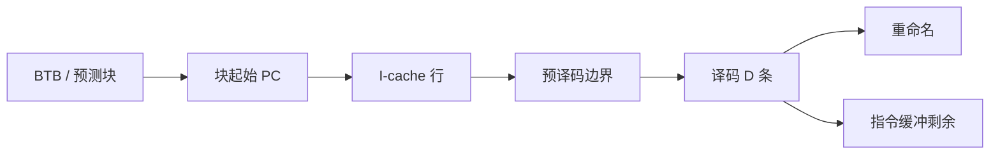

# 取指与译码带宽

窗口再宽，每拍从 I-cache 送进译码器的字节数不够，发射队列也会饿死；变长 ISA 还让「一条」的边界本身就是关键路径。

<footer>—— 据 Hennessy and Patterson, CA:AQA；Palacharla 等对前端复杂度的讨论 整理</footer>

[上一课](/cs/value-prediction) 在后端用猜测填窗口。后端再能猜，指令还是要从 IF 进来。[超标量发射](/cs/superscalar-issue) 已经要求每拍 $W$ 条；乱序核的 $W$ 更大，且分支之后的取指块可能不对齐。本课不重讲值表。缺口是**前端带宽：对齐、预译码、跨行、以及变长指令的扫描。**

## 问题

RISC-V 定长 32 位（压缩 16 位另计）时，取 $W$ 条近似取 $4W$ 字节并对齐。x86 指令 1–15 字节，下一条起点依赖本条长度，扫描是串行进位链。I-cache 行边界、BTB 提供的起始 PC、预测块里的多条分支，都会让「这一拍的 $W$ 条」凑不齐。缺口不是再加一个 ALU 口，而是**让译码宽度配得上发射宽度**。

前端停顿在 PMU 里常表现为 fetch starved：IQ 空、后端闲。与后端 replay 不同，这时预测器再准也没用，因为指令根本没进窗口。

## 方法

取指块：按 BTB/预测给出起始 PC，从 I-cache（可多 bank）读一行或两行，预译码位标出指令边界与是否分支。译码宽度 $D$ 条送入重命名；多余的留在指令缓冲。跨行取指：一行末尾不够 $D$ 条则同时读下一行，或下一拍再取。

压缩指令（RISC-V C、x86）让边界表更密。宏指令若要拆成微操作，译码带宽要以 uop 计，那是后课 uop cache 的动机。

## 机制

[CPI](/cs/cpi-amdahl) 的理想项变成 $\max(1/D, 1/W_{\text{issue}}, \ldots)$ 的前端截断。分支密度高则每拍有效 $D$ 下降：块在第一条预测分支处截断。这就是为何 BTB 与 gshare 不只影响损失拍，还影响**取指打包**。

功耗：每拍解 x86 边界的长度译码器是热点，推动后课把热循环的 uop 缓存起来，绕过长度扫描。

## 边界

本课不引入 uop cache 的命中路径，下一课才绕过译码器。也不把跟踪缓存（Rotenberg）当主干实现，只承认「把连续执行痕迹存起来」是同一类前端捷径。循环流缓冲是再下一课。

后课默认：前端有明确的每拍指令/字节上限；变长 ISA 的上限更脆。热路径若能跳过译码，带宽可以再挖一层。

## 小结

- 取指/译码宽度是窗口的供给；变长 ISA 让供给更贵。
- 预测块截断会让有效宽度低于名义 $D$。
- 把热 uop 缓存起来绕过译码器，是下一课。
- 出处：Hennessy and Patterson, *CA:AQA*；Palacharla, Jouppi, Smith, *ISCA*, 1997。
