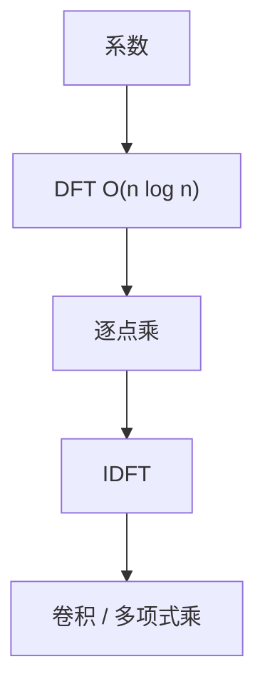

# FFT

多项式点值表示下乘法是逐点乘；DFT 把系数变成点值，$O(n\log n)$ 而不是 $O(n^2)$ 的求值。

<footer>—— 据 Cooley and Tukey, An Algorithm for the Machine Calculation of Complex Fourier Series, 1965；CLRS 第 30 章整理</footer>

上一课[Karatsuba](/cs/karatsuba)三次半长乘。多项式乘仍是卷积。缺口是 FFT：在单位根上求值与插值。不重写 Karatsuba 恒等式。后课 NTT 把复数换成模意义单位根。本课复数 DFT 的算法结构。

## 问题

$n$ 次多项式系数乘：$c_k=\sum_{i+j=k}a_i b_j$。点值：$C(\omega^k)=A(\omega^k)B(\omega^k)$。DFT：$A(\omega^k)=\sum_j a_j \omega^{jk}$。Cooley–Tukey：偶奇拆分，$T(n)=2T(n/2)+O(n)=O(n\log n)$。卷积定理：循环卷积 = IDFT(DFT A · DFT B)。线性卷积把长度补到够，或补零。

缺口是蝶形，不是信号处理课的频谱物理。

### 浮点误差

单位根是复数，浮点 FFT 乘大整数要选精度或改 NTT。本课算法正确性在精确算术；实现大数乘下一课。不要把数值噪声当卷积定义。

Cooley–Tukey 1965（Gauss 更早有同类分裂）。CLRS 30 写多项式 DFT。后课 NTT 服务精确卷积。

## 方法

$n$ 为 2 的幂。递归偶奇，或迭代位逆序 + 蝶形。逆变换：$\omega^{-1}$ 并除 $n$。卷积：补零到至少 $2n-1$。

位逆序实现细节不挡主线。

## 机制

$\omega^{n/2}=-1$ 使偶奇拆分不重叠。与分治乘：都是 $O(n\log n)$ 与 $O(n^{1.585})$ 的不同代数。圆周卷积有环绕，线性卷积须防。与矩阵：DFT 是 Vandermonde，直接乘 $O(n^2)$。

## 边界

本课不写 Bluestein、不写实数打包全部技巧。不写卷积定理的连续傅里叶。后课默认：多项式乘可用 FFT $O(n\log n)$（浮点）。下一课 NTT 精确模乘。

## 小结

- DFT 求值 $O(n\log n)$；卷积变逐点乘。
- 循环 vs 线性：补零。
- 大整数精确乘常改 NTT。
- 出处：Cooley and Tukey, 1965；CLRS 第 30 章。
