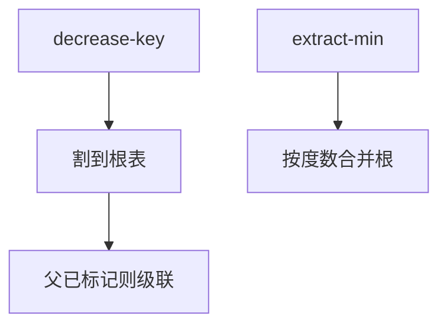

# 斐波那契堆

减键只把节点割下挂到根表，摊还 $O(1)$；代价堆在 extract-min 的Consolidate 上，用度数与标记限制树的形状。

<footer>—— 据 Fredman and Tarjan, Fibonacci Heaps and Their Uses in Improved Network Optimization Algorithms, JACM 1987；Cormen, Leiserson, Rivest and Stein 整理</footer>

[上一课](/cs/leftist-pairing-heap)给出可并与实践中的配对堆。Dijkstra 一类算法要很多次 `decrease-key`，数组堆每次 $\Theta(\log n)$。本课不重写 npl。缺口是斐波那契堆：摊还 $O(1)$ insert/meld/decrease-key，$O(\log n)$ extract-min，从而堆优化最短路的理论界。

## 问题

需要优先队列支持减键。二叉堆减键 $\Theta(\log n)$。斐波那契堆：根是循环链表；每棵树近似「度数 $d$ 则规模至少 $F_{d+2}$」（斐波那契增长），故最大度数 $O(\log n)$。decrease-key：降低键，若破坏堆序则割下该节点到根表，父若已标记则级联割。extract-min：删最小根，孩子变根，再按度数合并（consolidate）。缺口是**把形状约束推迟到 extract-min**，让减键走快捷路径。

CLRS 第 19 章是标准写法。标记表示「已经丢过一个孩子」；再丢则级联，保证度数–规模的斐波那契关系。

## 方法

insert：新节点入根表，更新 min 指针。meld：链两根表。decrease-key：如上割。势能：根数 + 两倍标记数，使级联割的摊还为 $O(1)$。

与配对堆：斐波那契常数大（指针多、consolidate），实践常输；理论界清楚。不要把 $O(1)$ 写成最坏。

## 机制

Dijkstra + Fib 堆：$O(m+n\log n)$。这是本课对算法课的接口，不在这里再推最短路正确性。空间每个节点若干指针与度数、标记，比二叉堆厚。

实现陷阱：循环链表边界、consolidate 数组按度数索引。教学以不变量为主，不要求交一份无 bug 代码当作业唯一解。

## 边界

本课不把严格 Fibonacci 堆或 rank-pairing 的全部变体写完。最坏 $O(1)$ 减键是 Brodal 等另一结构，点名即可。下一课二项堆：更早、形状更规则的可并堆，便于理解「按秩合并」。

后课默认：理论减键用 Fib 堆说话。教学与实现可退回配对或二项。

## 小结

- Fibonacci 堆：摊还 $O(1)$ 减键与 meld，$O(\log n)$ extract-min。
- 标记与级联割维持度数–规模。
- 实践常数大；二项堆形状更干净。
- 出处：Fredman and Tarjan, *JACM*, 1987；Cormen et al. 第 19 章。
