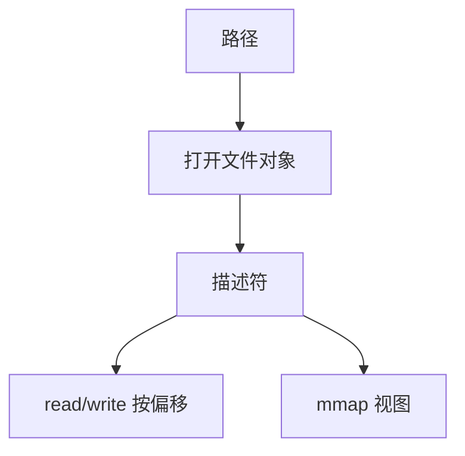

# 文件作为字节流

Unix 文件是无结构的字节序列；记录格式属于用户程序，不属于内核。

<footer>—— 据 Ritchie and Thompson, The UNIX Time-Sharing System, 1974 整理</footer>

[上一课](/cs/memory-reclaim)已经能把某段字节接到虚地址，但「文件」还只是映射的后端。[系统调用路径](/cs/syscall-path)上的 `read`/`write` 需要一个与页表无关的对象：打开实例、偏移、可读可写。缺口是把文件定义为**字节流**，目录与 inode 仍未展开。

## 问题

若内核坚持记录式文件（固定字段），管道和设备套不进去。Unix 的选择：文件是线性字节，位置由打开文件描述（偏移）记住。同一磁盘 inode 可被多次打开，各有各的偏移。缺口不是磁盘调度，而是用户看见的抽象：描述符、流、阻塞直到有数据——与[管道](/cs/ipc-pipe)同一接口。

本课不把「一切皆文件」扩到 epoll 的全部历史。

描述符是进程映像里的整数索引。fork 复制表；exec 可保留。偏移在 *打开文件* 对象上，所以 dup 的两个描述符共享偏移。

## 方法

`open` 把路径解析成内核文件对象（下一课 inode），在 PCB 描述符表里占一槽，偏移为零（或追加）。`read`/`write` 按偏移搬字节，更新偏移。`lseek` 改偏移但不搬。管道与套接字也是描述符，只是没有可 seek 的线性介质。mmap 是同一文件对象的另一视图。

## 机制

字节流让管道、文件、后来的套接字共用一套系统调用，用户程序可以重定向标准输入而不重编译。结构化记录（数据库页）在用户或后课数据库栏自己做；OS 主干不把关系模型请进来。阻塞语义接调度：没有字节就睡，写者或磁盘完成再醒。

与 mmap 的差别：`read` 的错误是返回值；拷贝进用户缓冲，不暴露页 Cache 的虚地址。两种接口对着同一持久字节。

## 边界

本课不引入记录锁定的全部 POSIX 细节，不把 Windows 的 HANDLE 当另一套理论。也不讲文本与二进制在内核里的差别：Unix 内核不做 CRLF 翻译。路径如何变成编号，下一课 inode 与目录。

`pread`/`pwrite` 不移动共享偏移，给线程共用一个描述符时少一种竞态；偏移仍是打开文件的属性。

后课默认：用户通过描述符看见字节流。名字与元数据落在 inode 与目录里，下一课收。

## 小结

- 文件是无结构字节序列；记录是用户的事。
- 描述符指向打开实例；偏移在打开文件上。
- 路径解析与 inode 是下一课。
- 出处：Ritchie and Thompson, *CACM* 1974；Tanenbaum *MOS*。
