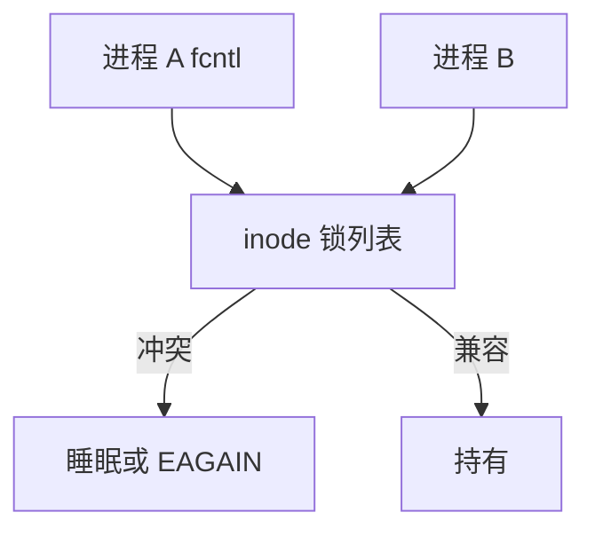

# 文件锁

建议锁只约束自愿调用 flock/fcntl 的进程；强制锁让普通 read/write 也会 EAGAIN。两者都不替代应用自己的协议。

<footer>—— 据 POSIX fcntl 锁；McKusick 对 BSD flock 的讨论；Linux <code>fcntl(2)</code> 对 OFD 锁的整理</footer>

[上一课](/cs/nfs-semantics)已点名远程上锁更难。本地也不是「文件自带互斥」：[字节流](/cs/file-bytestream) 默认可同时写。缺口是 **文件锁**：整文件 `flock`、字节范围 `fcntl`、打开文件描述锁（OFD），以及它们与 [VFS](/cs/vfs) 的关系。

## 问题

两个编辑器写同一文件，页缓存共帧，内容交错。锁提供劝告：`F_WRLCK` 互斥，`F_RDLCK` 共享。POSIX 记录锁历史上与进程绑定：关任意 fd 可能释放该进程对该 inode 的全部锁——这是著名陷阱。Linux OFD 锁跟打开文件描述走，更接近「这个 fd」。强制锁（mandatory）需挂载选项与模式位，今日少用。缺口：锁等待、死锁检测（部分内核做）、NFS 上的 NLM/v4 lock。

`LOCK_EX` 的 flock 与 fcntl 锁在 Linux 上曾不互通，后有统一。教学上把它们当成可能分裂的名字空间，查清再混用。

## 方法

`fcntl(F_SETLKW)`：VFS 在 inode 的锁列表上排队，冲突则睡眠。fork 不继承 POSIX 记录锁；dup 共享。释放：显式 `F_UNLCK` 或按上述规则随 fd/进程走。NFS：锁要到服务器登记，租约到期可能丢。对照互斥原语主干课：文件锁可跨进程、可按字节范围，但不保护内存里的其它结构。

## 机制

文件锁把「文件是共享字节数组」补上自愿互斥。数据库常绕过它自己做 WAL 锁；编辑器用它或用锁文件。不要把强制锁当默认安全网：TOCTOU 与网络 FS 上不可靠。与 [mmap](/cs/fs-mmap-coherence)：锁不自动覆盖映射写，除非应用自己锁。

死锁：同一进程对重叠区间升级锁可能自死锁，POSIX 允许检测返回 EDEADLK。

实现上：关闭任意 fd 释放该进程 POSIX 记录锁，是历史包袱，OFD 锁才跟打开文件走。NFS 上锁是租约，网络分区后可能丢，应用必须能重建。 读法上只引用[上一课](/cs/nfs-semantics)的结论，不把对象换成训练推理或限价簿。

本课在操作系统进阶的「文件系统实现 / 接口进阶」课序里，对象是 **文件锁**。

- 先修只引用，不重导：上一课的结论当公理，本课只补差。
- 五栏不吞并：不把本课写成大模型训练/推理，也不写成限价簿或权重量化。
- 文献用 OSTEP、McKusick、内核文档与具名会议论文；不发明 arXiv 编号。

## 边界

本课不引入 `flock` 在 `open` 文件与 `LOCK_NB` 的全部组合测试。不保证 Windows 强制锁与 POSIX 一一对应——对照课在 NT 后课。下一课从「互斥写」转到「谁改了树」的通知：inotify。

版本字段会变，课序钉的是机制对象「文件锁」，不是某一主线内核的结构体名。
后课默认：文件上可以有自愿范围锁。目录与 inode 事件如何推给用户态，下一课 inotify。

## 小结

- flock/fcntl 主要是建议锁；强制锁少用。
- POSIX 记录锁与进程绑定，OFD 跟打开描述。
- 目录事件通知是下一课。
- 出处：POSIX；Linux `fcntl(2)`；McKusick；NFS 锁协议概述。
