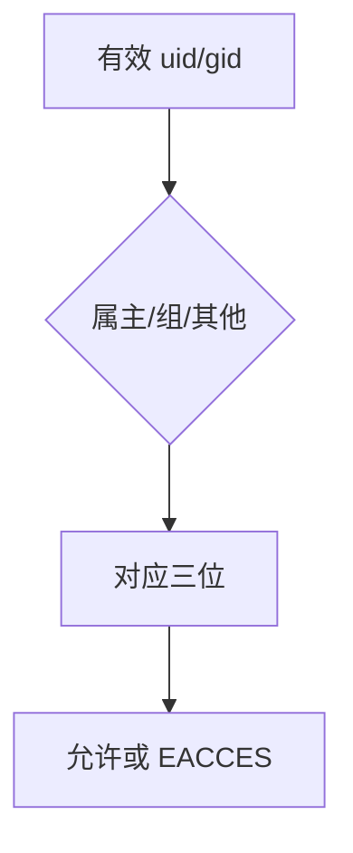

# 文件模式位

每个 inode 带有类型与 rwx 三位一组：属主、同组、其他人；内核在 open 与执行时按有效身份核对。

<footer>—— 据 Ritchie and Thompson；Bach；POSIX 对 mode 的整理</footer>

[上一课](/cs/crash-consistency)保证恢复后 inode 还在。[inode 与目录](/cs/inode-dir) 已列权限字段，尚未当课。[路径查找](/cs/path-lookup) 用了目录搜索位。缺口是把 **st_mode** 收成可执行的规则：类型比特、九位 rwx、以及与后课 setuid 的接口。不是 ACL 百科——那是安全课更细的模型。

## 问题

若只有「能 open 就能读写」，多用户机器无法共享 `/tmp` 又保住私有文件。Unix：uid/gid 对 inode 的 uid/gid，匹配属主则看属主三位，否则看组，再否则看 other。目录的 r=读目录项，w=增删项，x=把该目录当查找路径。文件的 x=允许 exec。缺口不是新的磁盘块，而是 `open`/`execve` 里的这次比较。

本课不把 POSIX ACL 的每一项写成默认。

`umask` 在创建时关掉一些位。`chmod` 改模式。类型（普通、目录、链接、设备）占 mode 的高位，与 rwx 共存一个字。

## 方法

创建：申请 inode，写入创建者 uid/gid 与 `mode & ~umask`。访问：沿路径已查过各目录 x；对目标比较 r/w。root（或有能力者）通常绕过，除执行位等少数例外——细节留给安全课。与 [VFS](/cs/vfs) 接头：具体 FS 把 mode 存在 inode，VFS 做通用检查。

## 机制

模式位把隔离从页表接到文件对象：同一内核，不同用户看见不同可打开集合。它不代替用户/内核分裂。管道与套接字也有 inode 模式，但常由创建者限定。不要把模式位写成提权 cookbook；只讲核对发生在 VFS。

下一课的 setuid 会在 exec 时暂时改有效 uid，本课的比较规则仍然适用，只是「有效身份」变了。

## 边界

本课不引入 SELinux 标签。不把 Windows ACL 当对照考试。粘滞位、setgid 目录继承在下一课与 setuid 一起，以免本课吞并。安全栏的最小特权会引用本课九位，不在这里重写。

后课默认：open/exec 按九位核对。exec 时身份提升与 `/tmp` 删除规则，下一课 setuid 与粘滞位。

## 小结

- mode 含类型与三组 rwx；目录 x 是搜索。
- 核对用有效 uid/gid；umask 限制新建。
- setuid/粘滞位是下一课。
- 出处：Ritchie and Thompson, 1974；Bach, *UNIX*；POSIX `<sys/stat.h>`。
