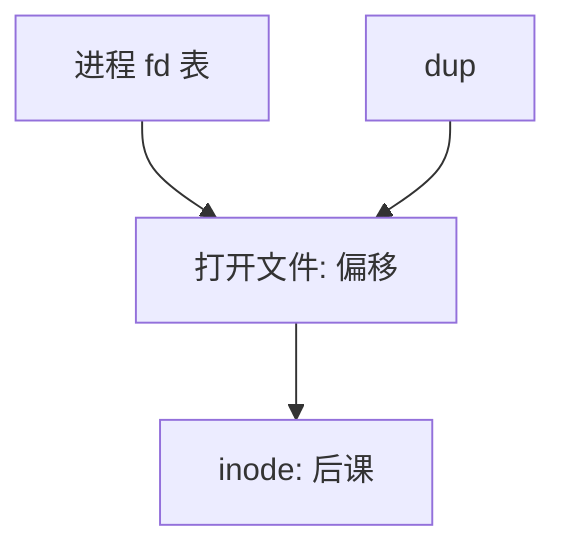

# 打开文件表

描述符是进程里的整数下标；它指向系统打开文件表的一项，那里才记着偏移与指向 inode 的指针。

<footer>—— 据 Bach, The Design of the UNIX Operating System；Ritchie and Thompson 的整理</footer>

[上一课](/cs/file-bytestream)把文件定义为字节流，并点到「偏移在打开文件对象上」。缺口是把这句话收成**三层表**：进程描述符表、系统打开文件表、inode（下一课才展开）。`dup`、`fork`、`close` 的语义全由「谁指向谁」决定，而不是再解释 `read` 拷贝字节。

## 问题

若偏移存在 inode 上，两个独立 `open` 会互相移动对方的读写位置。若偏移只存在描述符上，`dup` 得到的两个整数又应对同一偏移。Unix 折中：描述符表项是指针；打开文件对象（file）持有偏移与状态；多个描述符可指向同一 file；多个 file 可指向同一 inode。缺口不是磁盘格式，而是这张引用图。

本课不把 `O_CLOEXEC` 的每一位旗标写完。

fork 复制描述符表，于是父子共享同一批打开文件对象与偏移。exec 可关闭 CLOEXEC 的那些。close 减引用，到零才释放 file。

## 方法

`open`：分配 file，偏移清零，在进程表里找最小空闲整数当 fd。`dup`：新槽指向同一 file。`lseek` 改 file 的偏移。独立 `open` 两次同一路径：两个 file，两个偏移。[系统调用路径](/cs/syscall-path)上 `read(fd)` 只解第一层下标，越界则 EBADF。引用计数保护并发 close。

## 机制

三层表让管道、套接字、普通文件共用 fd 空间：file 上的操作向量可以不同，用户只看见整数。这与虚存的 fd 无关——mmap 也抓住同一 file/inode。不要把表写成数据库的连接池；它是进程映像的一部分，随[进程](/cs/process-image)复制与退出回收。

回收器/shrinker 不收缩「打开着的」file；那是引用计数对象。

## 边界

本课不引入 POSIX 的 `dup3` 全部细节。不把 Windows HANDLE 表当对照考纲。inode 与目录内容下一课才是持久结构；本课允许说「file 指向一个编号对象」。路径如何变成该对象，再下一课查找。

后课默认：fd 与偏移的共享规则已定。名字查找的缓存，下一课 dentry。

## 小结

- fd → 打开文件（偏移）→ inode；dup 共享偏移，两次 open 不共享。
- fork 复制 fd 表，共享打开实例。
- 名字到对象的缓存是 dcache 的缺口。
- 出处：Bach, *UNIX*；Ritchie and Thompson, 1974；Tanenbaum *MOS*。
