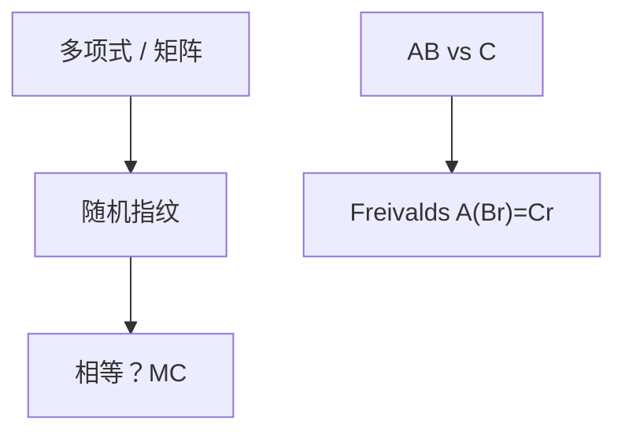

# 指纹与 Freivalds

把长对象映射到随机模的短指纹；Freivalds 用随机向量 $O(n^2)$ 检验矩阵乘，错概率 $1/|S|$。

<footer>—— 据 Freivalds, Fast Probabilistic Algorithms, 1977；Motwani and Raghavan；CLRS 第 5、32 章整理</footer>

上一课[Las Vegas 与 Monte Carlo](/cs/las-vegas-monte-carlo)钉了 MC。指纹：串/多项式/矩阵的哈希，碰撞则可能假阳性。缺口是 Freivalds：检验 $AB=C$ 不必 $O(n^3)$ 再乘一遍。不重写 Karatsuba。后课随机游走混合。

## 问题

多项式恒等：随机 $x$ Schwartz–Zippel，$d$ 次多项式在有限 $S$ 上撞根 $\le d/|S|$。串匹配 Rabin–Karp 同精神。Freivalds：$A,B,C$ 为 $n\times n$，随机 $r\in\{0,1\}^n$，看 $A(Br)\stackrel{?}{=}Cr$，三次矩阵–向量 $O(n^2)$。错当 $AB\neq C$ 仍相等，概率 $\le 1/2$（域更大则更小）。重复 $k$ 次。

缺口是检验不是计算乘积。

### 不是密码学碰撞抗性

这里是算法 MC，模随机素数。对手看到随机数之前选输入。自适应对手另论。

Freivalds 1977。Schwartz–Zippel。Rabin–Karp。后课混合时间是马尔可夫，不是指纹。

## 方法

选随机点或向量，模大素数。失败则「可能不等/再试」。要 Las Vegas 乘仍用确定乘。

串：滚动哈希注意溢出当模。

## 机制

线性：$(AB-C)r=0$ 对随机 $r$ 当 $AB-C\neq 0$ 很少。多项式：$P(x)=0$ 根少。与 NTT：NTT 精确卷积；指纹是概率检验。与哈希表：指纹可当键，有碰撞。

## 边界

本课不写密码学哈希函数。不写 PCP 指纹。后课默认：$O(n^2)$ 检验矩阵乘用 Freivalds。下一课随机游走与混合。

## 小结

- 指纹把相等检验变成 MC。
- Freivalds $O(n^2)$ 检验乘。
- Schwartz–Zippel 管多项式。
- 出处：Freivalds, 1977；Motwani–Raghavan。
