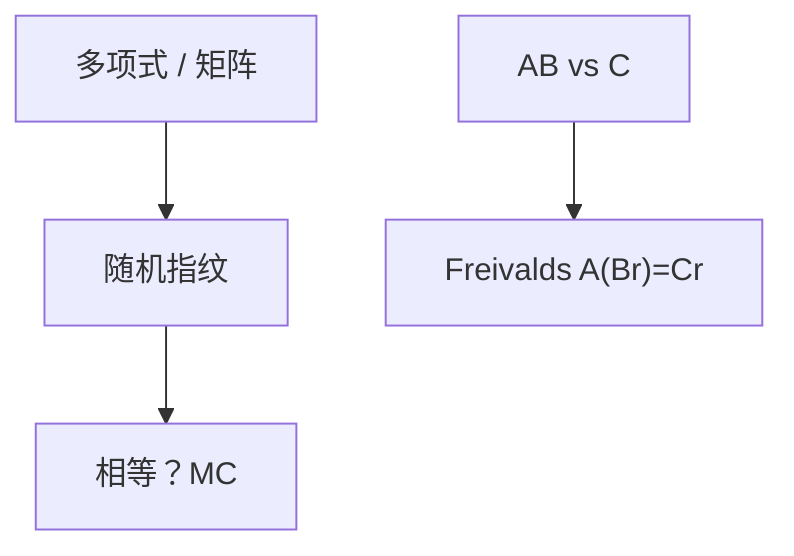

# 指纹与 Freivalds

把长对象映射到随机模的短指纹；Freivalds 用随机向量 $O(n^2)$ 检验矩阵乘，错概率 $1/|S|$。

<footer>—— 据 Freivalds, Fast Probabilistic Algorithms, 1977；Motwani and Raghavan；CLRS 第 5、32 章整理</footer>

上一课[Las Vegas 与 Monte Carlo](/cs/las-vegas-monte-carlo)钉了两类随机算法的合同；本课主题是指纹：把串、多项式、矩阵映射成随机的短摘要，相等检验变成比对指纹——碰撞只是可控概率的假阳性。缺口是 Freivalds：检验 $AB=C$ 不必再做一遍 $O(n^3)$ 的乘法。本课不重写 Karatsuba；后课随机游走与混合时间。

## 问题

三个实例。多项式恒等：随机取点 $x$，Schwartz–Zippel 给出界——$d$ 次多项式在有限集 $S$ 上撞根的概率 $\le d/|S|$，相等则必真，不等则大概率现形。串匹配的 Rabin–Karp 同精神：模随机素数的滚动哈希当指纹。Freivalds：随机向量 $r\in\{0,1\}^n$，检验 $A(Br)\stackrel{?}{=}Cr$，三次矩阵–向量乘共 $O(n^2)$；若 $AB\neq C$ 却判等的错概率 $\le 1/2$，换成大域取值更小，重复 $k$ 次错概率指数下降。

缺口是「检验」这个任务，不是计算乘积本身。

### 不是密码学碰撞抗性

这不是密码学的碰撞抗性：指纹的安全性来自随机数在对手选定输入**之后**才抽取——对手若能看到你的随机数再选输入，界即失效。自适应对手要另论。

Freivalds 1977。Schwartz–Zippel。Rabin–Karp。后课混合时间是马尔可夫，不是指纹。

## 方法

套路一致：选随机点或随机向量、模大素数防溢出；判等则接受（可能错），判不等则断言不等（必真）或再试一轮。要 Las Vegas 式的确定性答案，就证伪即重试直到收敛。

```mermaid
flowchart TD
  OBJ["多项式 / 矩阵"] --> FP["随机指纹"]
  FP --> EQ["相等？MC"]
  AB["AB vs C"] --> FR["Freivalds A(Br)=Cr"]
```

实现注意：滚动哈希的乘加要用模运算防溢出，模数取大素数。

## 机制

机制一句话：非零对象在随机投影下很少变零。线性代数版：$D=AB-C\neq 0$ 时 $Dr=0$ 要求 $r$ 落进 $D$ 的零空间，随机 $r$ 撞进去的概率小；多项式版：非零 $d$ 次多项式至多 $d$ 个根。指纹由此把「相等检验」整体变成 Monte Carlo。与 NTT 对照：NTT 是精确卷积，指纹是概率检验，一个算一个验。与哈希表对照：指纹可当键但带碰撞概率，哈希表靠冲突解决而非随机化。

## 边界

本课不写密码学哈希函数，不写 PCP 定理里的指纹。后课默认：$O(n^2)$ 检验矩阵乘用 Freivalds。下一课随机游走与混合。

## 小结

- 指纹把相等检验变成 MC。
- Freivalds $O(n^2)$ 检验乘。
- Schwartz–Zippel 管多项式。
- 出处：Freivalds, 1977；Motwani–Raghavan。
