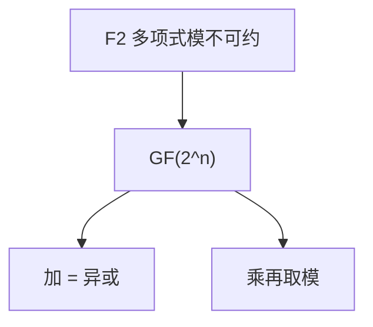

# 有限域 GF(2ⁿ)

$\mathbb{F}_2[x]$ 模一个 $n$ 次不可约多项式，得到 $2^n$ 元域；字节上的 AES 与 RS 符号都在这里做乘。

<footer>—— 据 Lidl and Niederreiter, Finite Fields；Daemen and Rijmen, AES 整理</footer>

上一课[群环域](/cs/group-ring-field) 说有限域阶为 $p^k$。缺口是 **$p=2$ 的显式构造**：比特串当多项式，$\oplus$ 为加，乘模不可约 $p(x)$。RS 课已经用过「能除」；本课把 $\mathrm{GF}(256)$ 钉住。

## 问题

$\mathbb{F}_2[x]/(p(x))$，$p$ 不可约次数 $n$，是 $2^n$ 元域，在同构意义下唯一。元素：$n$ 比特。加：按位异或。乘：多项式乘再模 $p(x)$。AES 用 $x^8+x^4+x^3+x+1$。求逆：扩展欧几里得在 $F_2[x]$ 上，或 $a^{254}$（费马，$|\mathbb{F}^\times|=255$）。

不可约 $\ne$ 本原。本原多项式使 $x$ 生成乘群，便于实现。本课能乘即可。

### 不是 $\mathbb{Z}/2^n\mathbb{Z}$

$\mathbb{Z}/256\mathbb{Z}$ 有零因子，不是域。AES 的字节乘绝不是模 256 整数乘。这是最常见的混层。

Lidl–Niederreiter 有限域手册。Rijndael 规格写明多项式。本课不把 S 盒当定义；S 盒是仿射+逆，协议层。

## 方法

在 $\mathrm{GF}(4)=\mathbb{F}_2[x]/(x^2+x+1)$ 列出四元乘表。对照 RS：符号在 $\mathrm{GF}(2^8)$ 时一个错是一个域元。指出：硬件上乘可用指令或表。

## 机制

有了 $\mathrm{GF}(2^n)$，线性码、AES、GCM 的域运算有同一载体。下一课乘群的生成元与离散对数在奇素数域上更常讲，但 $\mathrm{GF}(2^n)^\times$ 同样循环。本课不碰离散对数难度。

扩域塔（$\mathrm{GF}((2^8)^2)$）点名，不构造。

不可约性可用筛或查表；$n=8$ 的 AES 多项式固定。乘法可用 CLMUL 类指令。求逆：$a^{2^n-2}=a^{-1}$（$a\neq 0$）。$\mathbb{Z}/2^n\mathbb{Z}$ 与 $\mathrm{GF}(2^n)$ 基数相同、运算不同，混用会把 AES 与模幂写错。RS 符号宽 $n$ 时字母表就是这个域。

## 边界

本课不证存在不可约多项式，不引入迹函数。不写 AES 轮函数。后课默认：字节域 = $\mathrm{GF}(2^8)$ 多项式基。下一课生成元与离散对数。

字节乘是多项式模不可约式，不是模 256 整数。AES 与 RS 共用这一载体。乘群仍循环，离散对数下一课在奇素数域上讲得更标准，结论可平移。

上一课留下的缺口在本课收口；「有限域 GF(2ⁿ)」进入后课词汇表后只引用。文献用来钉对象与边界，不把本课写成该主题的独立综述。

## 小结

- $\mathrm{GF}(2^n)$ 是 $\mathbb{F}_2[x]$ 模不可约 $n$ 次式。
- 加是异或；不是模 $2^n$ 整数环。
- AES、RS 符号在此做四则。
- 出处：Lidl and Niederreiter；Daemen and Rijmen, AES。
