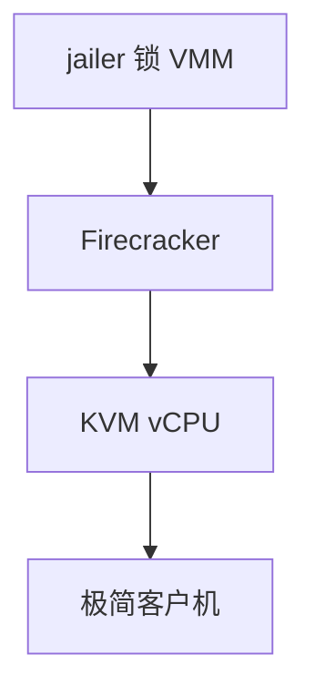

# Firecracker

Firecracker 是用 Rust 写的瘦 VMM：KVM + 极少 virtio 设备，为每函数或每容器起一台微 VM，启动以毫秒计。

<footer>—— 据 Firecracker 设计文档；[KVM/QEMU](/cs/kvm-qemu) 为完整 VMM 对照</footer>

[gVisor](/cs/gvisor) 截 syscall。[QEMU](/cs/kvm-qemu) 设备太多。缺口是 **microVM**：Firecracker 砍设备模型。

## 问题

只留 virtio-net/blk、串口、非常少的 PCI。缺口：与 [容器](/cs/container-runtime) 的 jailer（chroot、cgroup、seccomp 锁 VMM）；快照恢复。本课不把 Lambda 产品写成云广告。

无 USB、无 VGA。对象是攻击面与冷启动，不是桌面虚拟化。

## 方法

jailer 起进程 → KVM 建 VM → 客内核 + 极简 rootfs。对照 QEMU：少 exit 路径种类。对照 runc：多一层客户内核。对照 [SR-IOV](/cs/sriov-passthrough)：微 VM 常用 virtio 而非直通。

## 机制

Firecracker 把「每租户一内核」的隔离做到能水平铺开，用砍设备换启动与 CVE 面。客户仍是真内核，syscall 兼容好于 gVisor。不要写成 serverless 计费。与 [热迁移](/cs/live-migration)：有快照，完整 live 不是主路径。

内核配置要为微 VM 裁剪——[kbuild](/cs/kernel-config-build)。

实现上：API 套接字在 jailer 之后才听，攻击面从 VMM 进程开始锁。无 PCI 扫描减少客户攻击。快照把内存+设备状态当微函数冷启动加速。 读法上只引用[上一课](/cs/gvisor)的结论，不把对象换成训练推理或限价簿。

本课在操作系统进阶的「虚拟化与隔离进阶 / 容器与内核形态」课序里，对象是 **Firecracker**。

- 先修只引用，不重导：上一课的结论当公理，本课只补差。
- 五栏不吞并：不把本课写成大模型训练/推理，也不写成限价簿或权重量化。
- 文献用 OSTEP、McKusick、内核文档与具名会议论文；不发明 arXiv 编号。

## 边界

本课不引入所有 API 套接字。不保证嵌套。下一课 Kata：容器接口 + VM。

版本字段会变，课序钉的是机制对象「Firecracker」，不是某一主线内核的结构体名。
后课默认：微 VMM 用 KVM 跑裁剪客户。Kata 把 OCI 接到 VM，下一课。

## 小结

- Firecracker：瘦设备模型的 KVM VMM。
- jailer 锁住 VMM 进程本身。
- Kata 是下一课。
- 出处：Firecracker 文档；KVM；OCI。
