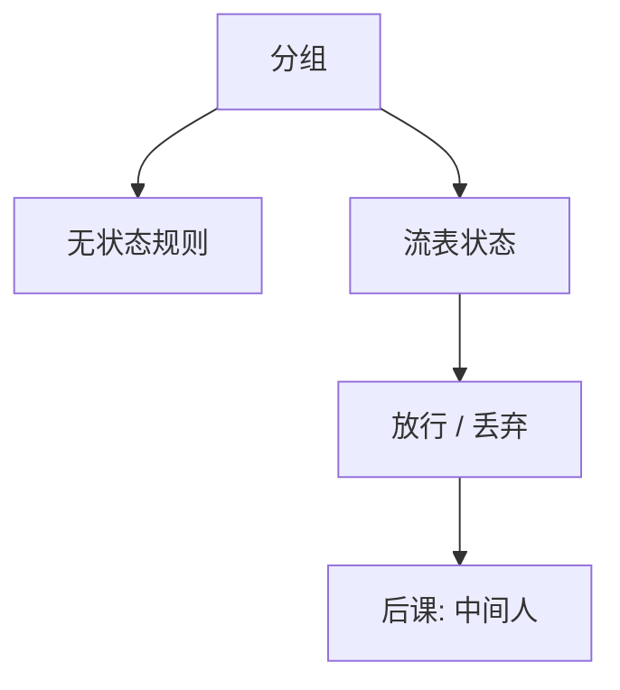

# 防火墙与状态

边界按策略允许或拒绝分组；有状态的那一层记得「这是已允许会话的回复」，而不是每一包单独看端口号。

<footer>—— 据 Cheswick, Bellovin and Rubin；Stallings 对分组过滤与状态检测的整理</footer>

[上一课](/cs/tls13-0rtt)把应用数据收进 AEAD。本课不重做 ClientHello。缺口是：网络边界仍要执行访问控制，但载荷已不可读。防火墙在 IP/端口/状态上落实最小特权：默认拒绝，只允许声明过的五元组与回程。这是[ACL](/cs/acl-least-priv)在分组上的投影，不是另一种密码。

## 问题

无状态过滤只看单包的地址与端口，无法区分「新连接」与「已建立的回程」，也难处理动态端口。缺口不是再讲[IP 编址](/cs/ip-subnet)，而是连接跟踪：记下 TCP 状态或超时的 UDP 流，只让匹配的回包通过。TLS 之后，第七层 HTTP 规则除非终止 TLS，否则看不见路径。

状态表本身是资源：表满则可用失败（CIA 的 A），也是后课放大攻击的一种打点。默认拒绝比默认允许更符合 Saltzer 的失败安全。

## 方法

策略：入站/出站、源与目的、协议、端口、已建立。状态检测维护流表。NAT 常与状态表绑在一起（[DHCP 与 NAT](/cs/dhcp-nat)已有地址翻译）。本课不把下一代 DPI 产品当理论：加密提高 DPI 的代价，策略应假设看不见明文。

## 机制

防火墙缩小攻击面：未声明的入站服务根本到不了套接字。它不认证对端是谁——那是 TLS 与应用。状态表使回复合法，也使伪造「已建立」成为另一类威胁（需序列号等到 TCP 课已有的难度）。与沙箱对照：一个在主机进程，一个在网络边界，矩阵的客体分别是系统调用与分组。

无状态规则挡不住「已建立」伪造到何种程度，取决于是否跟踪序列与超时。

## 边界

防火墙不是杀毒，也不修溢出。加密隧道可以从允许的端口把任意应用带出去（策略泄漏）。本课不教如何躲过防火墙。中间人若位于防火墙终止 TLS 之处，身份模型完全改变——下一课。

出站默认允许、入站默认拒绝是常见折中：内部主机仍可能被当跳板。最小特权要求出站也收敛。后课默认：边界可以有状态 ACL；主动者若插在链路上，要靠认证而不是靠「端口开了」。

策略是访问控制，状态表是实现。表的超时必须大于合法往返、小于资源耗尽窗口，这是可用与正确的折中。

## 小结
- 默认拒绝加显式允许，是最小特权在分组上的投影。
- 后课中间人是认证几何，不是再加一条端口规则能关的。

- TLS 藏载荷；防火墙用五元组与流表做最小特权。
- 状态表服务回程，也消耗内存（可用轴）。
- 主动插入链路冒充端点，是中间人课。
- 出处：Cheswick, Bellovin and Rubin；Stallings；Saltzer and Schroeder 原则。
