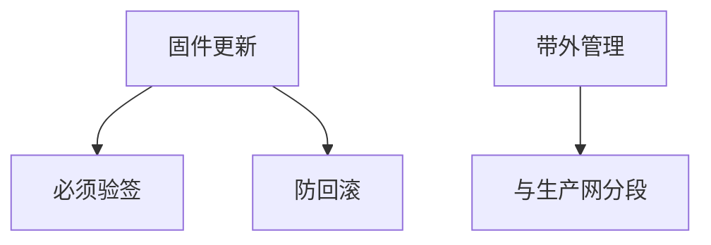

# 固件安全

固件先于操作系统，更新通道常弱：无签名、无回滚保护、管理引擎不透明。固件完整是 TCB 的底，补丁窗口与供应链在此最痛。

<footer>—— 据 NIST SP 800-193；UEFI 对胶囊更新的讨论；对照 Intel 管理引擎的公开分析点名</footer>

## 定位

上一课[安全启动](/cs/secure-boot-chain)假定固件是锚的一部分。缺口是**固件自己的更新与植入**。本课讲签名更新、防回滚、带外管理，不写刷入恶意固件的步骤。

后课默认已经读完本课钉下的合同，只补差，不从该领域第一性原理重开。

## 问题

BIOS 密码空、更新不验签、回滚到易受版本。缺口是：签名、版本单调、带外管理面与主机隔离。

### 供应

出厂植入不在 OS 扫描器视野。SBOM 对固件更弱。

SP 800-193 平台固件弹性。禁止固件植入教程。功耗分析下一课换物理侧信道。

## 方法

对照主机补丁与固件补丁周期。管理网分段。下一课 DPA。

图中节点是本课的机制骨架；课程不把图展开成可运行的攻击步骤。

## 机制

TCB 含固件。物理攻击下一课假设盒子在手。

前提写进合同之后，游戏外的误用只当失败模式点名，不在本课写成操作程序。

## 边界

不写刷机攻击。功耗分析 DPA 下一课。

## 小结

- 启动链含固件；固件更新必须验签。
- 防回滚与带外面是合同。
- OS 扫描看不见出厂植入。
- 下一课功耗分析。
- 出处：NIST SP 800-193；UEFI；Anderson。
