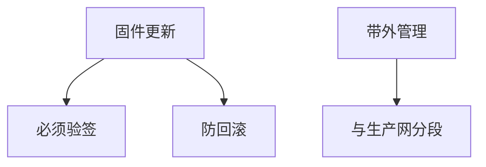

# 固件安全

固件先于操作系统，更新通道常弱：无签名、无回滚保护、管理引擎不透明。固件完整是 TCB 的底，补丁窗口与供应链在此最痛。

<footer>—— 据 NIST SP 800-193；UEFI 对胶囊更新的讨论；对照 Intel 管理引擎的公开分析点名</footer>

## 定位

上一课[安全启动](/cs/secure-boot-chain)假定固件是锚的一部分。缺口是**固件自己的更新与植入**。本课讲签名更新、防回滚、带外管理，不写刷入恶意固件的步骤。

后课默认已经读完本课钉下的合同，只补差，不从该领域第一性原理重开。

## 问题

BIOS 密码空、更新不验签、可回滚到已撤销版本、BMC 挂默认口令在生产网。固件在 OS 之下：植入后重装系统、换盘都清不掉，还能在启动早期钩住 OS 载入的内核。缺口是：签名、版本单调、带外管理面与主机隔离。

### 供应

出厂植入不在 OS 扫描器视野。SBOM 对固件更弱：SPI 镜像混着多供应商闭源模块，组件清单难完整（回 [SBOM](/cs/sbom-reproducible-builds)）。采购能要的是签名更新承诺与披露渠道，不是源码。

SP 800-193 平台固件弹性。禁止固件植入教程。功耗分析下一课换物理侧信道。UEFI 撤销靠 dbx 拒绝库：BootHole（CVE-2020-10713）后批量撤销引导器；SP 800-193 三步是 protect/detect/recover。

## 方法

更新通道三件套：胶囊验签（平台根钥锚在硬件）、防回滚（版本号单调计数或熔丝）、恢复镜像（双分区或只读备份，对应 recover）。对照主机补丁与固件补丁周期——固件窗口以季度计，dbx 撤销与微码更新也要入周期。带外管理（BMC/IPMI、管理引擎）有独立 IP 与独立 OS，常漏在资产清单外；管理网分段。下一课 DPA。

```mermaid
flowchart TD
  UPD["固件更新"] --> SIG["必须验签"]
  UPD --> RB["防回滚"]
  OOB["带外管理"] --> SEG["与生产网分段"]
```

图中节点是本课的机制骨架；课程不把图展开成可运行的攻击步骤。

## 机制

启动链逐级验证：boot ROM 验 SoC 固件，固件验引导器，[TPM](/cs/tpm-measured-boot) 把各阶段度量进 PCR——固件不能自证，只能向上锚定硬件根（掩膜 ROM、熔丝）。失败模式：验证跳线被短接、NVRAM 变量被改、SPI 芯片离线重写；远程攻击者到不了这些，物理接触者可以——那是下一课的威胁模型。TCB 含固件。供应链任一环失守都写入底座，ME/PSP 这类不透明管理引擎因此被点名。物理攻击下一课假设盒子在手。

前提写进合同之后，游戏外的误用只当失败模式点名，不在本课写成操作程序。

## 边界

不写刷机攻击。功耗分析 DPA 下一课。本课只点名管理引擎的 TCB 地位，不评其内部实现。

## 小结

- 启动链含固件；固件更新必须验签。
- 防回滚与带外面是合同。
- OS 扫描看不见出厂植入。
- 下一课功耗分析。
- 出处：NIST SP 800-193；UEFI；Anderson。
