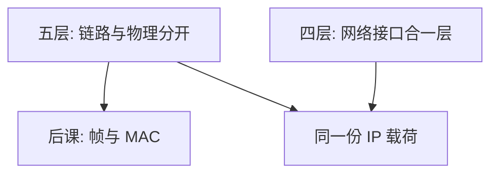

# 五层与四层对照

教学用五层把链路与物理拆开；TCP/IP 四层把它们收成「网络接口」。层名是对照表，不是另一套互联网。

<footer>—— 据 Kurose and Ross 对五层模型；Cerf and Kahn, 1974；RFC 791/793 的职责切分整理</footer>

[上一课](/cs/layering-e2e)钉死分层与端到端：功能按层放，正确性在真正两端收口。本课不重做 Saltzer 的文件传送例子。缺口是课序马上要进入一跳的帧：读者会同时碰到教材的五层与实现口里的四层。两套名字对不齐，后课 MAC 与 IP 会像两门课。

## 问题

[分层](/cs/layering-e2e)已经画出应用、传输、网络、链路、物理。主机协议栈与许多教材把链路加物理叫做网络接口（或「链路」一层），于是只数四层。OSI 七层还多出会话与表示。缺口不是再背一张图，而是：**同一份 PDU 在两种数法里落在哪**，以免把「第四层」一会儿说成传输、一会儿说成链路。

四层不取消物理；它只是不单独当一章。五层把 CRC、介质访问与电信号分开讲，方便本栏下一课进帧。

## 方法

对照而不是合并。五层：应用 PDU → 传输段/数据报 → 网络分组 → 链路帧 → 物理比特。四层：应用、传输、互联网、网络接口；接口层同时承担成帧与把比特送到介质。RFC 791 的 IP、RFC 793 的 TCP 按四层职责写成「网际 + 传输」；本栏仍用五层上课，因为帧的 FCS 与 MAC 还没有对象。

## 机制

机制是命名约定。后课谈到「链路 PDU」一律指帧；谈到「网络 PDU」指 IP 分组。套接字接到传输，不接到 MAC。端到端论证不依赖数了几层：可靠性仍不能只放在接口层。组成课的 [DMA](/cs/io-dma) 进出的是接口缓冲，内容将被解释成帧，然后才是分组。

## 边界

本课不把 OSI 会话/表示插进主干，也不把跨层优化（如 QUIC 把传输与安全绑在 UDP 上）提前当反例写完。七层是历史对照；本栏以五层为课序，四层为实现口译。

后课默认：一跳的名字在链路，跨网的名字在 IP。下一课只补帧与 MAC，不再争论层数。

## 小结

- 五层与四层是同一栈的两种切法；本栏按五层往下读。
- 链路与物理合层不取消成帧，只是合章。
- 一跳 PDU 从下一课的帧开始。
- 出处：Kurose and Ross；RFC 791；RFC 793；Cerf and Kahn, 1974。
