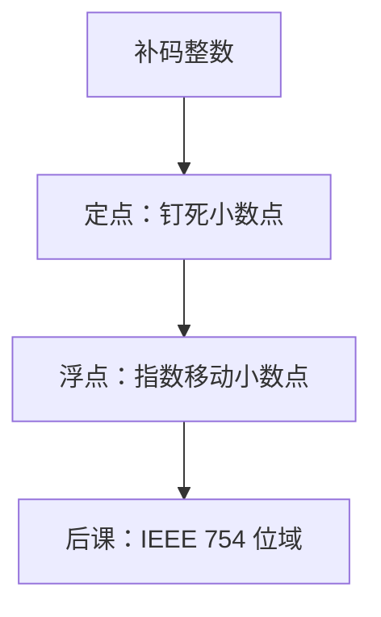

# 定点与浮点

整数编码把小数点钉死在某一位；要同时覆盖很大和很小，必须让小数点跟着指数走。

<footer>—— 据 Patterson and Hennessy, Computer Organization and Design (RISC-V)；Goldberg, What Every Computer Scientist Should Know About Floating-Point Arithmetic, 1991 整理</footer>

上一课[符号幅度与反码对照](/cs/sign-magnitude)钉死了有符号整数：同一套模 $2^n$ 加法，溢出按同号和异号读。本课不重讲负权，也不从「实数是什么」另起。缺口是：补码只能表示整数。测量、比例、后课的地址偏移以外的「带小数的量」，还没有编码。

## 问题

$n$ 位补码的间距处处是 $1$。要把间距改成 $2^{-f}$，只需宣布小数点在第 $f$ 位之后：这是**定点**。可表示集合仍是一个等差格子，动态范围仍约 $2^n$。科学计算要的是另一件事：相对精度大致均匀，绝对值可以从很小到很大。缺口因此不是再造一套补码，而是把一个数拆成**尾数与指数**，让格子在原点附近变密、在远处变疏。

本课只钉这两种读法的差别，不把位域写成 IEEE 754 的具体宽度。那是[下一课](/cs/ieee-754)的缺口。

### 浮点不是「实数」

定点是缩放整数，加减可以先对齐小数点再走整数 ALU。浮点的加减必须先对阶：指数不同则尾数要移位。结果通常不能精确表示，只能舍入。把浮点当成「连续量终于回来了」，会把[第一课](/cs/bit-as-distinction)的判决丢掉：浮点仍然是有限比特串。

Goldberg 强调：浮点是有限集合上的算术，不是 $\mathbb{R}$ 的子集运算。Patterson/Hennessy 先讲定点缩放，再引入 $x = \pm m\times b^e$。

## 方法

定点：选定 $f$，数值为 $\mathrm{val}(x)\cdot 2^{-f}$（补码或无符号皆可）。乘法是整数乘再算术移位；溢出仍按整数规则，只是单位改了。

浮点：约定符号、尾数 $m$、指数 $e$，数值 $\pm m\times 2^e$（基 $2$ 是后课默认）。规格化要求 $m$ 落在半开区间 $[1,2)$，使同一值只有一种写法——本课只要求这个直觉，隐藏位与偏置指数留给 IEEE 754。

## 机制

定点把精度预算花在绝对误差上，适合货币的最小单位、传感器的固定刻度。浮点把预算花在有效位数上：加减会吞掉阶差过大的尾数，这是**精度损失**，不是补码那种溢出旗标。两种失败模式不要混名。

乘除对浮点相对自然：尾数乘、指数加。加减才是贵的。后课 ALU 会先做整数，浮点通路是另一套；本课只要求：同一比特串，读法从「整数」换成「定点或浮点」之后，相等关系都变了。

## 边界

本课不规定 `binary32` 的 8 位指数、23 位尾数，不引入 NaN、无穷、非规格化数。也不讨论十进制浮点或区间算术。字符、文本编码与数值无关，是再后一课。

后课默认：谈到「机器上的非整数」，先问是定点缩放还是浮点。浮点的可移植位型，下一课才钉死。

## 小结

- 定点是缩放整数，格子均匀；浮点用指数换动态范围。
- 浮点加减要对阶并舍入；失败是精度损失，不是补码溢出。
- 规格化使同一值尽量一种写法；具体位域是后课。
- 出处：Patterson and Hennessy, COD (RISC-V)；Goldberg, 1991。
