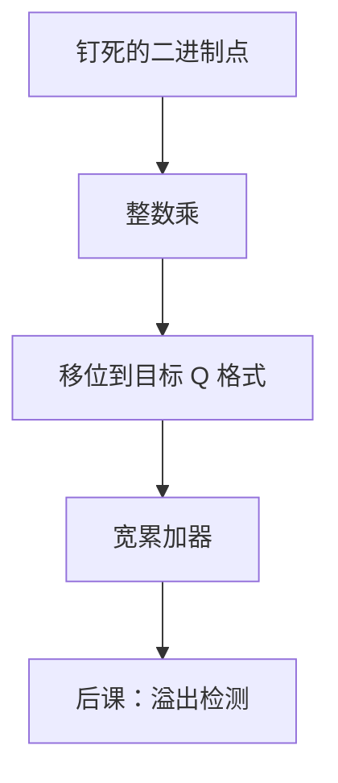

# 定点 DSP 运算

  
小数点钉在位域里某处，乘加就是整数乘加再约定截位；没有对阶，也没有 NaN，溢出得自己决定是环绕还是饱和。

  <footer>—— 据 Harris and Harris, Digital Design and Computer Architecture；Patterson and Hennessy, Computer Organization and Design (RISC-V)；ITU-T G.191 / 常见定点 DSP 约定 整理</footer>

[上一课](/cs/lzc-normalize)让浮点用 LZC 把小数点挪回隐藏位之前。许多信号路径（音频、控制环、早期基带）并不需要 754 的动态范围，却需要确定的延迟与更小的面积。缺口是：**定点小数**——同一套[阵列乘](/cs/array-multiplier)与加法器，二进制点由程序员或 ISA 约定钉死。

## 问题

Q15、Q31 一类格式：16/32 位里 1 位符号、其余是分数。乘：两个 Q15 得 Q30，往往左移 1 位丢掉多余符号位，再截回 Q15。MAC：累加器比乘数更宽，防止一串加立刻溢出。缺口不是再讲浮点对阶，而是：没有指数、没有[五类标志](/cs/fp-exceptions)的默认递送，**溢出策略**必须另选——环绕（补码模 $2^n$）或下一课的检测/再下一课的饱和。

FPGA DSP 块、ASIC MAC 都是这条通路的硬化。本课不把它们写成厂商原语清单。

### 定点不是「精度更差的浮点」

误差模型不同：定点是绝对量化步长恒定（在满量程内），浮点是相对（ulp 随指数变）。把定点当 `float` 关掉规格化，舍入与溢出语义都不对。DSP 里的「1.0」常常是 `0x7FFF`，没有 754 的 +inf。

Harris 把定点当作二进制小数点的位置。Patterson/Hennessy 用定点对照浮点。本课不进入限价簿或金融定点货币——那是量化栏；这里是 ALU 数据通路。

## 方法

约定格式 $Qm.n$。加：先对齐二进制点（通常已对齐），整数加。乘：整数乘，二进制点位置相加，再移位到目标格式，按截断或四舍五入取位。累加器宽度 $m+n+\text{guard}$。舍入用多出来的低位，但没有 754 的五种模式义务——实现选定一种。

与 FMA 对照：定点 MAC 通常每步截入累加器或保持全宽直到输出，由设计者选；没有「754 强制一次正确舍入」的同一合同，除非产品规范另写。

## 机制

后两课整数溢出检测与饱和，正是定点 DSP 的收尾策略。浮点用指数和 NaN；定点用标志位或饱和到满量程。后课 HDL 会看到这些 MAC 被写成流水线与时钟使能，本课只钉算术。

## 边界

本课不讲块浮点（每块一个共享指数），不把 SIMD 打包定点写成 NEON 指令表。不重写 Transformer 的量化感知训练。不进入光刻成像或限价簿。

后课默认：定点乘加是整数乘加加移位；溢出尚未规定如何呈现。

## 小结

- 浮点靠指数与 LZC；定点靠约定的二进制点。
- MAC 用宽累加器；截位规则是实现合同。
- 溢出策略下一课起才钉。
- 出处：Harris and Harris；Patterson and Hennessy, COD (RISC-V)。
