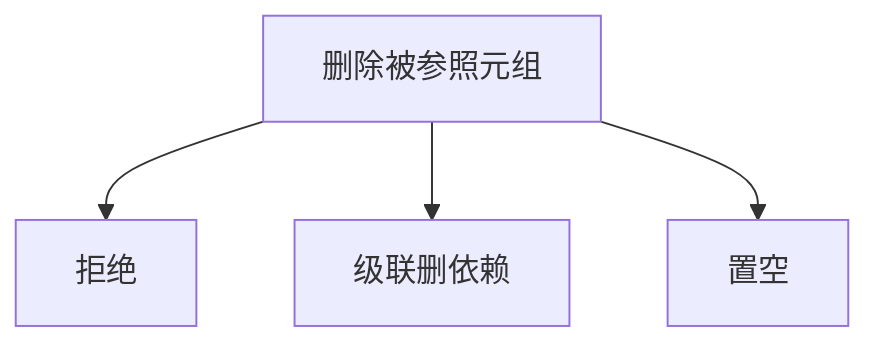

# 外键与参照动作

外键要求引用的值在被参照关系里存在；删除或更新被参照元组时，级联、限制或置空是事先声明的动作。

<footer>—— 据 Codd 对参照完整性；Date；SQL 标准对 FOREIGN KEY 动作的整理</footer>

[上一课](/cs/keys-integrity)钉死候选键、主键与「引用是值」。本课不重讲超键。缺口是更新语义：删客户时订单怎么办？只声明外键而不声明动作，实现会拒绝或留下悬挂，应用各写各的。参照动作把政策收进模式。

## 问题

[键与完整性](/cs/keys-integrity)留下外键作为值上的约束。删除被参照行：RESTRICT/NO ACTION 拒绝；CASCADE 删除依赖行；SET NULL 要求列可空（后课三值逻辑）。更新主键同样有级联或拒绝。缺口是**参照动作**，不是代数。

循环参照与延迟约束检查（事务末再验）是实现细节。本课只要求动作是模式的一部分，而不是触发器散文化。

## 方法

声明：列集参照另一表的候选键，并给出 ON DELETE / ON UPDATE。插入依赖行时立即检查存在性。复合键必须整组对应。本课不把触发器替代外键当推荐默认。

## 机制

动作让完整性在修改时封闭，避免「先删后补」的窗口里出现悬挂指针式的值。查询代数假定实例满足约束；若动作与应用意图不符，那是模式选错，不是选择投影错。后课 SQL 的声明查询建立在合法实例上。

## 边界

本课不引入分片库之间的跨库外键（后课分片会放弃）。也不把外键当安全的授权。有了合法关系，如何用运算生成新关系，下一课关系代数。

后课默认：删除与更新的参照政策已在模式里。查询语言还没有。

## 小结

- 外键检查存在性；动作规定删改时的政策。
- 级联、拒绝、置空是声明，不是临时脚本。
- 关系代数下一课。
- 出处：Codd；Date；SQL 参照动作。
