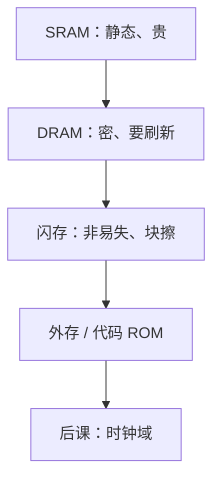

# 闪存对照

DRAM 靠电容、掉电即忘；闪存把电荷关进浮栅，不刷新也能留，但写是按块擦再编程，不能当随机存取的主存。

<footer>—— 据 Harris and Harris, Digital Design and Computer Architecture；Patterson and Hennessy, Computer Organization and Design (RISC-V) 整理</footer>

上一课[DRAM 刷新](/cs/dram-refresh)钉死了易失阵列的周期性读回写。本课不重推保留时间，也不从文件系统 FTL 另起。缺口是对照：**非易失**如何进组成课——能当 BIOS/盘，不能替换那套需刷新的主存时序。

## 问题

浮栅（或电荷陷阱）存 0/1，读近似随机；写前通常要擦除，擦除粒度是块，远大于字。编程电压高、次数有限（磨损）。缺口不是半导体工艺步骤，而是与 SRAM/DRAM 的角色划分：片上 SRAM 快且易失，DRAM 主存要刷新，闪存作外存或片上 ROM 替代，接口是命令队列而不是「地址一到数据就稳」。

NOR 可按字节读、便于原地执行；NAND 密度高、按页读，作 SSD。本课点到，不把通道、磨损均衡写成 OS 课。

### 闪存不是「不需要刷新的 DRAM」

随机写延迟与寿命模型完全不同。把闪存插进单周期数据存储器框，关键路径与磨损都会说错。掉电保存不等于可以当寄存器。

Harris 把非易失列为另一类存储器。Patterson/Hennessy 用磁盘/闪存当存储层次底层。控制器常有独立时钟，[下一课](/cs/clock-domain)的跨域从这里开始有实物。

## 方法

读：选字线，阈值电压判决。写：先擦块再编程页。CPU 经控制器发命令，完成以中断或轮询通知——中断入口很后才讲，本课只承认「多拍、另一时钟」。

## 机制

存储程序的指令可以放在 NOR 闪上直接取指（片上 MCU），或先拷到 SRAM/DRAM。后课冯·诺依曼图里的「存储器」教学上仍是 DRAM/SRAM；闪存在层次最底下。刷新义务没有了，换成磨损与擦除。

## 边界

本课不讲 3D NAND 层数、不把光刻产线请进来。不讨论文件系统日志。EEPROM 字节可改是同一非易失家族的小容量形态。

后课默认：主存仍是 DRAM（加刷新）；闪存是非易失外存或 ROM；其控制器时钟可与 CPU 无关。

## 小结

- 闪存非易失，写按块擦、有磨损。
- 不能当 DRAM 的免刷新版主存。
- 控制器可能独立于 CPU 时钟，交给时钟域课。
- 出处：Harris and Harris；Patterson and Hennessy, COD (RISC-V)。
