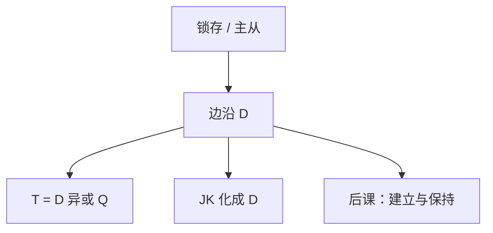

# D / T / JK 对照

边沿记忆只要一种：D 触发器。T 与 JK 是输入端的组合包装，便于计数或旧教材画法，不是另一种物理。

<footer>—— 据 Harris and Harris, Digital Design and Computer Architecture 整理</footer>

上一课[锁存与触发器](/cs/latch-flipflop)钉死了电平锁存与边沿 D 触发器。本课不重画主从，也不从异步状态机另起。缺口是：教科书还列 T、JK。后课建立保持、寄存器、FSM 默认 **D**；必须说清另外两种只是 D 加门。

## 问题

D：边沿把 $Q\leftarrow D$。T：边沿若 $T=1$ 则翻转，否则保持——即 $D=T\oplus Q$。JK：沿用 $J$ 置 $1$、$K$ 置 $0$、皆 1 则翻转；化为 $D=J\bar Q+\bar K Q$。缺口不是新的存储物理，而是激励表与 D 的等价，避免后课以为 CPU 里混用三种硬核。

异步置位/清零仍是端口，不改变「同步状态走 D」这一默认。

### JK 不是「功能更强所以更适合 CPU」

JK 能表达的下一态 D 全能表达。多两个输入只增加控制器接线。现代标准单元库以 D FF 为主。把 JK 当更通用的记忆，寄存器堆会画错。

Harris 用激励表互化。计数器可用 T（每位进位时翻转）或 D 接增量器。本课不把主从 JK 的 $1s$ 捕获当主干缺陷清单。

## 方法

列现态 $Q$、输入、次态 $Q^+$，反推 $D$。带使能的寄存器：$D=E\cdot D_{\mathrm{in}}+\bar E\cdot Q$。T 计数：低位 $T=1$，高位 $T=$ 低位全 1，与后课计数器一致。

## 机制

后课时序不等式写在 D 的 $t_{su}$、$t_h$、$t_{cq}$ 上。T/JK 的建立时间要把输入端组合算进路径。FSM 下一态逻辑的输出就是各位 D。本课结束「有哪几种触发器」的词条式罗列，把记忆收成一种元件。

## 边界

本课不讲脉冲触发、不把 ECL 之类工艺触发器请进来。不分析 JK 禁止输入（那是 SR 锁存的问题，边沿 JK 已避开）。

后课默认：同步状态是边沿 D 触发器；T/JK 仅在画计数器时作为简写。

## 小结

- 物理记忆用 D；T、JK 是输入组合。
- 激励表把任意下一态化成 D。
- 下一课把 D 的采样窗口写成建立与保持。
- 出处：Harris and Harris。
