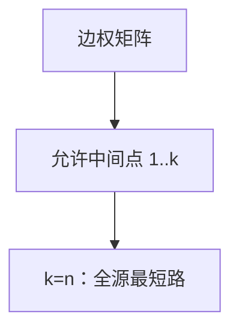

# Floyd–Warshall

允许中间点集合逐步扩大到 $V$，三维递推给出全部点对的最短路。

<footer>—— 据 Floyd, Algorithm 97: Shortest Path, 1962；Warshall, A Theorem on Boolean Matrices, 1962；CLRS 第 25 章整理</footer>

上一课[差分约束](/cs/diff-constraint)解决带负边的**单源**。全源若跑 $|V|$ 次，非负时 Dijkstra、一般时 Bellman–Ford，分别是 $O(VE\log V)$ 与 $O(V^2E)$ 量级。本课不重写松弛循环。缺口是：在邻接矩阵上用**中间点集合**做动态规划，一次 $O(V^3)$ 得到全部 $\delta(i,j)$。本课只钉这个递推；背包式 DP 的一般模板在更后。

## 问题

$d_{ij}^{(k)}$：从 $i$ 到 $j$、中间点只取自 $\{1,\ldots,k\}$ 的最短路长。要么不经过 $k$，等于 $d_{ij}^{(k-1)}$；要么经过，$d_{ik}^{(k-1)}+d_{kj}^{(k-1)}$。取 min。$k=0$ 为边权（无路 $\infty$）。$k=n$ 即全部点对。

负环：某 $d_{ii}<0$。与 Bellman–Ford 检测同现象，记账不同。仍要求没有负环，或至少报告对角负值。本课仍在 P。

### 不是「把 Dijkstra 跑 n 遍」的别名

Floyd 不维护优先队列，不管稀疏。稠密图 $E=\Theta(V^2)$ 时 $V$ 次 Dijkstra（二叉堆）是 $O(V^3\log V)$，Floyd 的 $V^3$ 更干净。稀疏非负全源更该 $V$ 次 Dijkstra。表示课已说矩阵对稠密自然。

Warshall 先做可达性布尔闭包；Floyd 把 min-plus 换成同一骨架。CLRS 25.2 就地滚动 $k$ 维。本课把「中间点」当唯一新对象。

## 方法

矩阵 $W$，三重循环 $k,i,j$：$d[i][j]\leftarrow\min(d[i][j],d[i][k]+d[k][j])$。就地可行，因 $k$ 维只依赖 $k-1$。前驱可同步更新。

[渐近](/cs/asymptotic-notation)：$\Theta(V^3)$ 次加法比较，与稀疏无关。

## 机制

min-plus 半环上的「乘法」是路径拼接。可达性把 min-plus 换成或-与，即 Warshall。后课动态规划会抽象最优子结构；本课已是实例，一般模板仍后置，以免图算法课变成 DP 绪论。

路径条数、最长简单路不能套同一三重循环：最长简单路会环、会指数。本课只 min 路径权。

## 边界

本课不加速稀疏。不处理负环上的「最短」定义。也不写 Johnson 算法（重新赋权再 Dijkstra）——那是稀疏全源的另一出口，不在本课。空间 $\Theta(V^2)$ 矩阵必须扛住。

后课默认：稠密全源可用 Floyd $\Theta(V^3)$。生成树问题换成无向边权的另一套最优，不是点对距离。

## 小结

- $d_{ij}^{(k)}$ 对中间点集合递推，$O(V^3)$ 全源。
- 对角负值报告负环。
- 稀疏非负全源更宜多次 Dijkstra。
- 出处：Floyd, 1962；Warshall, 1962；CLRS 第 25.2 节。
