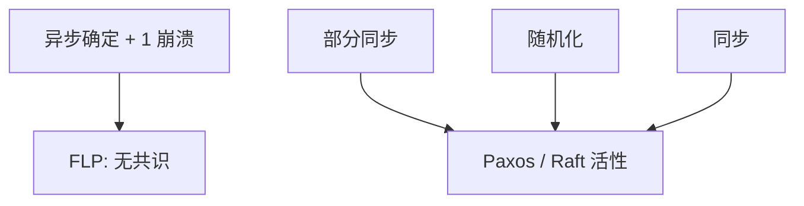

# FLP 不可能

完全异步、确定性、哪怕只允许一个崩溃，共识没有既安全又活的算法。超时与随机是逃出去的洞，不是推翻。

<footer>—— 据 Fischer, Lynch and Paterson, Impossibility of Distributed Consensus with One Faulty Process, JACM 1985 整理</footer>

上一课[租约](/cs/leases)靠期限才敢说「此刻只有一个主」。缺口是把这句话变成定理：**没有时间界时，连「终将同意一个值」都不能保证**。本课不重写崩溃停定义，不重做检测器分档。后课拜占庭是更强对手；FLP 在崩溃下已经足够否定。

## 问题

共识：终止（每个正确进程终决定）、一致（决定值相同）、有效（决定值是某输入）。模型：异步可靠信道、确定性进程、最多一个崩溃。Fischer–Lynch–Paterson：不存在满足三者的算法。

直觉：系统可以一直停在**双价**（bivalent）全局状态——两边决定都仍可能。从双价出发，调度器总能再走一步仍双价（否则那一步成了决定性步，对手推迟那条消息）。无限推迟则永不终止。证明的技术在于：单步改变一个进程的消息到达次序，用崩溃「藏起」那个进程。

Lynch 教材把 FLP 写成 I/O 自动机上的价论证。本课要的是模型边界：异步 + 确定 + 一崩溃 ⇒ 无共识。

## 方法

逃逸不推翻定理，只换模型：

- 部分同步 / 检测器 $\Diamond\mathcal{S}$：活性依赖终将同步。
- 随机化（Ben-Or）：以概率 1 终止，期望轮数无界。
- 失败检测与超时：实现 $\Diamond\mathcal{P}$ 的工程近似。
- 同步轮：直接有界。

Paxos 的安全在异步下成立，终止不保证——这不是实现偷懒，是 FLP 允许的形状。

## 机制

「双价」不是活锁 bug，是规格与模型的合取过强。工程上看到的选举超时、随机抖动，正是在部分同步里逼调度器离开双价区。把超时写进安全（「没在 30ms 内 ack 则另一值合法」）会破坏一致：那是用同步偷换异步。

信道不可靠（无限丢失）是另一条不可能，比 FLP 更粗：连投递都没有。FLP 假定可靠投递、只在调度上作恶，结论更锋利。

本课不把 CAP 当 FLP 的通俗版：CAP 谈分区与线性一致读写，FLP 谈异步崩溃与共识终止。后课会分开钉。也不把「区块链最终确认」当 FLP 反例：那些换了故障类、同步或概率。

## 边界

本课不写完整价引理，不引入拜占庭共识下界 $n>3f$。不把随机化协议的期望轮展开。后课默认：异步崩溃共识的安全与活要拆开证；看到「保证选出领导者」就问时间假设。下一课对手从崩溃升级到撒谎。

定理是模型的墙。后课所有多数派协议都在墙的某一侧开门。

## 小结

- 异步 + 确定 + 一崩溃 ⇒ 无既安全又终止的共识。
- 部分同步、随机、检测器是换模型，不是反例。
- Paxos/Raft 安全异步、活性靠超时，形状符合 FLP。
- 出处：Fischer, Lynch and Paterson, JACM 1985。
