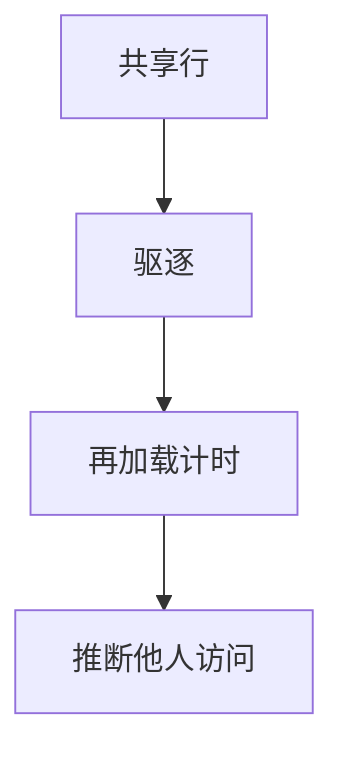

# Flush+Reload

共享页（含共享库）上，驱逐再等待再测加载时间，可推断别人是否访问了该行。这是缓存侧信道的经典形状：共享是特性，也是通道。

<footer>—— Yarom and Falkner, Flush+Reload, USENIX Security 2014</footer>

## 定位

上一课[Rowhammer](/cs/rowhammer-mitigations)扰动存储。缺口是**共享缓存当通道**。主干侧信道已警告时间。本课点名 Flush+Reload 作为机制名字，不给测密钥步骤。

后课默认已经读完本课钉下的合同，只补差，不从该领域第一性原理重开。

## 问题

dedup 与共享 libc 创造共享行。高分辨率计时。缺口是：禁共享、降计时精度、常数时间密码、隔离核。

### 云共驻

同主机租户是模型里的观察者。

Yarom–Falkner 2014。禁止还原密钥的实验指导。VM 逃逸下一课换隔离边界。

## 方法

陈述共享+计时。对策。下一课虚拟机逃逸：逻辑边界而非缓存。

图中节点是本课的机制骨架；课程不把图展开成可运行的攻击步骤。

## 机制

C 可经缓存泄漏。VM 逃逸下一课是完整性：从客到宿。

前提写进合同之后，游戏外的误用只当失败模式点名，不在本课写成操作程序。

## 边界

不写测量配方。虚拟机逃逸下一课。

## 小结

- Rowhammer 翻比特；Flush+Reload 测共享行时间。
- 共享库与去重是通道来源。
- 常数时间与隔离是对策。
- 下一课 VM 逃逸。
- 出处：Yarom and Falkner, 2014；[side-channel](/cs/side-channel)。
