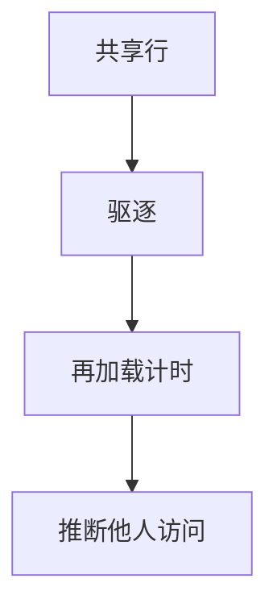
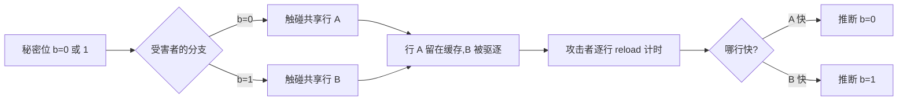

# Flush+Reload

共享页（含共享库）上，驱逐再等待再测加载时间，可推断别人是否访问了该行。这是缓存侧信道的经典形状：共享是特性，也是通道。

<footer>—— Yarom and Falkner, Flush+Reload, USENIX Security 2014</footer>

上一课[Rowhammer](/cs/rowhammer-mitigations)扰动的是存储比特；本课缺口是**把共享缓存当通道**。主干侧信道课已警告过时间泄漏；这里点名 Flush+Reload 作为该类机制的具名代表，不给测密钥的实验步骤。

后课默认已经读完本课钉下的合同，只补差，不从该领域第一性原理重开。

## 问题

内存去重（dedup）与共享 libc 让不同进程物理共享同一缓存行——共享是省内存的特性，也把「谁访问过这一行」变成可观测信号。攻击者把共享行驱逐出缓存，等受害者可能访问，再重新加载并计时：缓存命中（几十纳秒）与回内存取回（上百纳秒以上）的差距一眼可辨，这只需要一台高分辨率计时器。缺口是对策清单：禁共享页、降计时精度、密码学常数时间化、敏感计算核隔离。

给个数字感受一下差距：一次缓存命中约 40 纳秒，回内存取数约 200-300 纳秒，差出 5 倍以上。这两个数都远小于一次系统调用（微秒级），所以「加载一行代码并掐表」完全可以藏在正常程序运行里，日志上看不出任何异常。

### 云共驻

云上同主机的租户就是模型里的观察者：页去重一开，跨虚拟机的共享行天然存在，观察不需要任何越界访问。

Yarom–Falkner 2014。禁止还原密钥的实验指导。VM 逃逸下一课换隔离边界。

## 方法

方法是把「共享加计时」这条通道陈述完整，再逐条配对策：关页去重，把共享库从高价值进程拆开，计时器降精度加抖动，密码学写成无分支无密钥查表的常数时间，敏感计算钉上隔离核。下一课虚拟机逃逸：那是逻辑边界被穿，不是缓存被测。

```mermaid
flowchart TD
  SHARE["共享行"] --> FLUSH["驱逐"]
  FLUSH --> TIME["再加载计时"]
  TIME --> INF["推断他人访问"]
```

## 机制

机制一句话：控制流可经缓存泄漏——受害者的分支走向决定它触碰哪些共享行，攻击者逐行计时就把秘密位读了出来；命中与未命中之间数倍的延迟差是通道的载波。这也是 Spectre 类攻击的读出口。VM 逃逸下一课是完整性：从客机到宿主机。

可以把它想象成图书馆查岗：攻击者把某几本书全部搬走（flush），过一会儿再去看哪些书回到了原位——回到了，说明这段时间有人借阅过。书的内容一个字没看，但「谁碰过哪本」这个事实本身就把受害者的秘密漏了出来。

```mermaid
flowchart LR
  S["秘密位 b=0 或 1"] --> BR{"受害者的分支"}
  BR -- "b=0" --> L0["触碰共享行 A"]
  BR -- "b=1" --> L1["触碰共享行 B"]
  L0 --> C["行 A 留在缓存,B 被驱逐"]
  L1 --> C
  C --> M["攻击者逐行 reload 计时"]
  M --> R{"哪行快?"}
  R -- "A 快" --> G0["推断 b=0"]
  R -- "B 快" --> G1["推断 b=1"]
```

## 边界

不写测量配方——不给阈值、不给探针排布。边界要点名：对策没有单发银弹，降计时精度会被多次采样平均绕回，禁共享则付出内存与启动时间。虚拟机逃逸下一课。

初学者容易以为「把计时器精度降到 100ns 就安全了」。实际上攻击者可以让同一操作重复上万次、把带噪声的读数取平均——单个样本分不出 40ns 和 200ns，一万次平均后差距照样浮现。这就是为什么降精度只能抬门槛，必须配合常数时间才行。

## 小结

- Rowhammer 翻比特；Flush+Reload 测共享行时间。
- 共享库与去重是通道来源。
- 常数时间与隔离是对策。
- 下一课 VM 逃逸。
- 出处：Yarom and Falkner, 2014；[side-channel](/cs/side-channel)。
