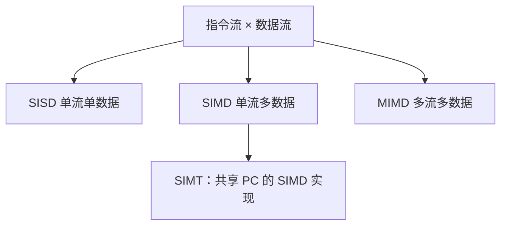

# Flynn 分类

按指令流与数据流的份数把机器分成 SISD、SIMD、MISD、MIMD；它不管缓存协议，只管「同时在飞的是一条指令还是很多」。 

<footer>—— 据 Flynn, Very High-Speed Computing Systems, Proceedings of the IEEE, 1966 整理</footer>

[上一课](/cs/fence-cost) 收束单核顺序与一致性进阶。单核 ILP 再挖也是一条指令流。[超标量](/cs/superscalar-issue) 每拍多条，仍是同一 PC 家族。本课不重讲 fence drain。缺口是 **Flynn 的四格：用指令流 × 数据流给后面的 VLIW、向量、SIMT、多核一个共同坐标系。**

## 问题

乱序核、向量机、GPU、多 socket 在文献里都叫「并行」， intern 容易把发射宽度与核数相加。缺口不是再加一种 cache 态，而是**先分箱：同一时刻有几条指令流、每条指令流操作几份数据。** 后续课只在格子里走，不把 GPU 写成「很大的超标量」。

SISD：经典单核。SIMD：一条指令、向量数据。MISD：少见（某些流水脉动可硬塞）。MIMD：多核、多线程各有 PC。

## 方法

SISD：本课程前两单元的核。SIMD：后课向量 lane、以及 ISA 对照里的 [SIMD 扩展](/cs/simd-extensions)——一条 opcode，多条 ALU。MIMD：后课多 socket、big.LITTLE。SIMT 是 SIMD 的控制实现：硬件上很多 lane 共享一个 PC，遇分支再发散，不是第四个 Flynn 类，下一课之后才拆。

## 机制

[阿姆达尔](/cs/cpi-amdahl) 在 MIMD 上变成「串行段限制加速比」；SIMD 上变成「向量化比例」。二者不要混用同一个 $f$。一致性只出现在 MIMD（及 SIMD 核之间的共享内存），SISD 无需 [MESI](/cs/mesi-protocol)。

本课声明边界：大模型栏的张量并行不是本栏的 Flynn 练习；这里只为 CPU/GPU/DSA 硬件分型。

## 边界

本课不把 VLIW 的编译器打包写完，下一课。也不把数据流机当成第五类 Flynn——Dennis 的数据流是另一轴，再下一课。MISD 不展开。

后课默认：谈到并行先报 Flynn 格子。把多条独立操作塞进一个长指令字，是 VLIW/EPIC。

## 小结

- Flynn 用指令流与数据流分 SISD/SIMD/MIMD。
- SIMT 是 SIMD 的控制包装，不是新格子。
- VLIW 把并行打包交给编译器，下一课。
- 出处：Flynn, *IEEE Proc.*, 1966。
