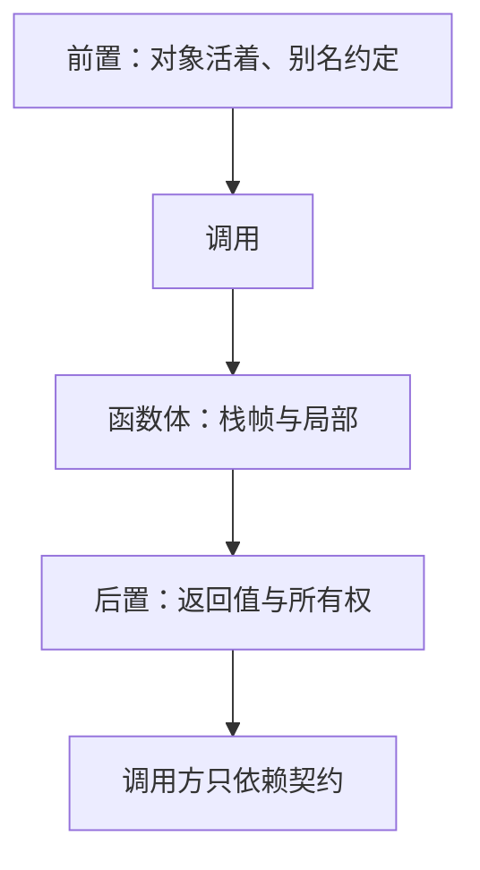

# 函数作为抽象边界

函数把一段可调用的实现藏在名字后面；调用方只依赖参数、返回值与写下来的副作用约定，而不是依赖函数体如何建帧。

<footer>—— 据 Kernighan & Ritchie, The C Programming Language, 2nd ed.；ISO/IEC 9899 整理</footer>

上一课[生命周期与悬挂](/cs/lifetime-dangling)钉死了：指针必须指向活对象，所有权不能靠运气。本课不重讲 `free`，也不从面向对象教材另起。缺口是：寿命与别名已经在机器上成立，**怎样把它们收成调用双方都能遵守的一句话**。函数是本栏里第一块有意设计的抽象，不是「把语句包起来少写重复」。

## 问题

调用约定已经说明参数怎么传；那是 ABI。抽象边界问的是语义：哪些对象由 callee 只读、哪些会被改、返回的指针活多久、失败时哪些事没有发生。缺口因此不是再画一张栈帧，而是**把机器事实写成契约**。没有契约，悬挂课里的「谁释放」只能靠读完整个函数体才能知道——那不是抽象。

C 没有私有字段关键字当默认工具。边界靠函数签名加注释加惯例：输出参数用指针，所有权转移在名字或文档里声明，纯查询函数不改静态状态。后课头文件会把契约复制到每个翻译单元；本课先承认契约附着在函数上。

### 函数不是「一段标签跳转」

机器上 call/ret 确实是跳转。抽象上，调用是进入另一个不变量成立的区域：进入时前置条件真，返回时后置条件真。把函数当成 goto 加注释，会允许从中途跳进跳出、共享所有局部，边界立刻消失。本课要的是可替换的实现：换掉函数体，只要契约不变，调用方源码不必改。

K&R 从第 1 章就把程序拆成函数，强调参数是接口。ISO C 的函数类型包含返回类型与参数类型，但不包含「谁释放」——那一层要由本课的纪律补上。后课测试会把契约变成可执行的例子。

## 方法

写函数时同时写清：输入对象的寿命必须覆盖整个调用；输出指针的寿命归谁；是否别名允许参数重叠；失败时返回什么、是否回滚已做的半步。返回码与详细错误留给[错误码与失败](/cs/error-code-failure)。这里只要求：边界上能回答「指针活多久」。

小函数可以内联，边界在优化后消失于指令序列，但源码级契约仍在：换一个编译器、关掉内联，程序语义应不变。这与 UB 课一致——契约对抽象机器成立，不依赖某一次内联决定。

纯函数（无副作用、不读可变静态）最容易测，也最容易替换。一旦函数读写文件或全局表，契约必须写清：改了哪些对象、失败时改了多少。这与错误码课衔接。调用约定保证参数能传过去；抽象保证传过去之后的意义稳定。内联与链接时优化可以跨过编译单元把函数体嵌进调用方，但若因此依赖某次内联才「碰巧正确」，那是把 UB 或未指定顺序当成实现细节——边界仍然按抽象机器来写。

## 机制

边界降低推理成本：调用方不必知道 callee 用了多少栈、是否递归、是否调用 `malloc`，除非契约声明会分配。实现方可以在体内改算法，只要不破坏寿命与别名承诺。这为后课模块化做准备：多个函数共享一份内部静态表时，边界必须扩大成「这组函数共同维护的不变量」，那是封装课的缺口。

函数指针把边界变成值：同一契约的不同实现可以在运行时切换。本课只承认这件事；虚表是更晚的布局课。不要把函数指针理解成「对象系统」，它仍是地址加上必须由程序员保证的契约。

C 标准库本身就是这套边界的样板：`fopen` 返回的指针指向的对象布局调用方看不见，寿命由 `fclose` 结束。调用方若保存内部缓冲指针越过下一次读写，契约被破坏。自己写的模块应当同样思考：哪些指针是借出（本次调用内有效），哪些是移交（调用方此后拥有）。函数指针让边界可替换，但不自动复制文档——类型只保证签名，所有权仍是人写的后置条件。后课头文件把这些签名发给其他 `.c`，边界才从「一个函数」变成模块。

## 边界

本课不讲异常展开，不把 C++ 引用当默认模型。下一课[模块与头文件](/cs/module-header)把边界从单个函数扩到翻译单元。后课默认：函数是契约边界；指针参数的寿命与所有权必须在边界上说清；实现可替换。

## 小结

- 函数隐藏帧与算法，向外只暴露契约：参数、返回、副作用、所有权。
- ABI 管怎么传；抽象管能承诺什么。两者都要，但不能互相替代。
- 可替换性要求调用方不依赖函数体。
- 下一课用头文件把契约发给其他编译单元。
- 出处：K&R 函数与程序结构；ISO C 函数类型。
