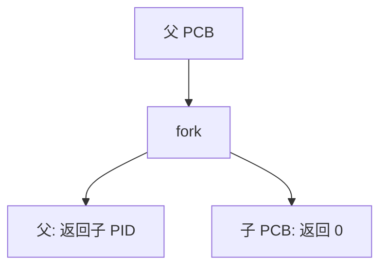

# fork

fork 把当前进程复制成子进程：子返回 0，父返回子的 PID；其后二者独立调度，默认共享打开文件表的引用。

<footer>—— 据 Tanenbaum and Bos, Modern Operating Systems；Ritchie and Thompson, The UNIX Time-Sharing System 整理</footer>

[上一课](/cs/pcb-task-struct)给出可分配的 PCB。用户要再跑一份程序，不能自己写一块内核对象。[系统调用 ABI](/cs/syscall-abi) 已有陷入约定。缺口是 Unix 的创建原语：**fork**——复制当前映像，一次调用两个返回。本课不把写时复制的页表细节写完，那是更后的 [cow-fork](/cs/cow-fork)。

## 问题

若只有「从文件加载新进程」，交互式 shell 无法在保留打开终端的同时换掉地址空间。fork 先克隆：子继承寄存器（除返回值）、页表（逻辑副本）、文件描述符。父继续原来的流。缺口不是新的 PCB 字段清单，而是这一调用的语义：谁返回什么、哪些资源共享引用计数、哪些必须真复制。

子进程地址空间在逻辑上独立：子写自己的栈不应改父的栈。实现上先共享只读页再在写时拆，是 cow 课；本课语义当立即独立。

## 方法

系统调用：分配新 PCB 与新 PID，复制或共享内存描述符、文件表（引用 +1）、信号掩码。子的 trapframe 从父拷来，把返回值槽写成 0；父的返回值是子 PID。子被放进就绪队列。失败则父得到错误，不存在「半个进程」。

多线程进程里 fork 只复制调用线程，POSIX 有规定；主干承认这一点，不背手册全文。内核线程一般不对外 fork。

## 机制

fork 把「创建」从「加载程序」拆开：先有两份映像，再用下一课 `execve` 把其中一份换成新程序。shell 的典型路径正是 fork 后子 exec、父 wait。返回值约定让同一份用户代码用 `if` 分成两路，不必两套入口。

复制页表根但不复制全部物理页，是性能；语义仍是独立地址空间。[分页](/cs/paging-vm) 的权限位稍后在 cow 课改写。

## 边界

本课不讨论 `vfork` 的暂停父进程优化当主路径，不把容器里 PID 映射写完。也不把 fork 炸弹当成习题去构造；资源限制是策略。`clone` 的细粒度标志是线程课。

后课默认：子是父的副本，返回值不同。子要换成另一个二进制，下一课讲 `execve`。

## 小结

- fork 复制 PCB 与地址空间语义；父得 PID，子得 0。
- 文件表常共享引用；页的写时复制是后课。
- 用新程序覆盖映像是 `execve`。
- 出处：Tanenbaum and Bos, *MOS*；Ritchie and Thompson, *CACM* 1974。
