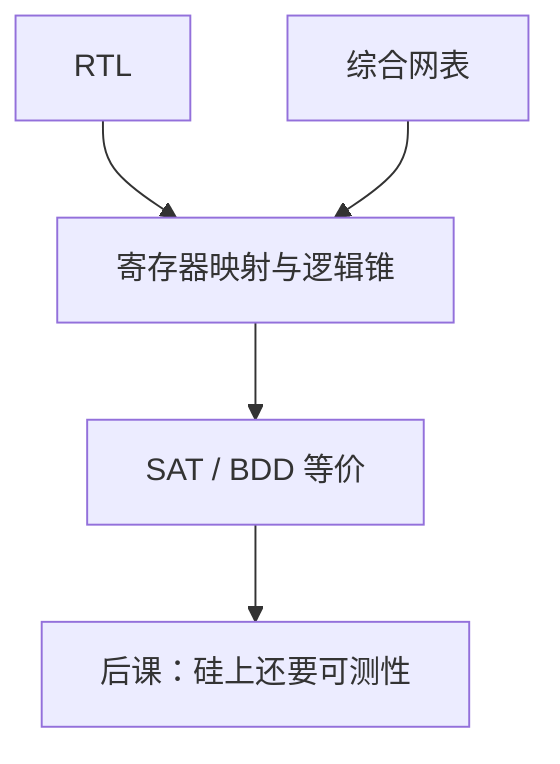

# 形式等价检查

  
综合可能改结构但不该改功能：等价检查把 RTL 与网表切成逻辑锥，用 SAT/BDDs 证明对应点相同，不依赖测试向量有没有打到。

  <footer>—— 据 Brand, Verification of Large Synthesized Designs, ICCAD 1993；IEEE Std 1800；Hennessy and Patterson 体系结构验证实践 整理</footer>

[上一课](/cs/verification-testbench)的仿真会漏未覆盖状态。[证明助手](/cs/proof-assistants)已展示「核检查」；数字流程里更常用的是**组合/时序等价检查**（LEC）：同一设计的两个视图是否功能相同。缺口是把这层签核接到综合网表，而不是再写 TB。

## 问题

综合优化、资源共享、FSM 编码可能改变中间节点。仿真回归成本随 NRE 涨。缺口：需要与向量无关的**结构对应证明**，把「工具没改功能」从「碰巧测过」里拆出来。

### 等价不是「符合 IEEE 754 规范」

两边都错会显示等价。规范符合性仍靠 TB、断言或更高层形式（属性检查）。把 LEC 通过当成 FMA 正确舍入的证明，黄金模型从未出场。

Brand, ICCAD 1993 是组合等价的经典工业问题表述。现代工具用 SAT。本课不发明 arXiv。属性检查（model checking）在计算理论补层的[模型检验](/cs/model-checking)已给直觉，这里用在网表签核。

## 方法

对应点：RTL 寄存器与网表 FF，由名称或映射文件配对。每个组合锥：从输入与寄存器 Q 到下一状态 D 与输出。证明两锥布尔等价。失败：给出反例向量，可送回仿真。时钟门控、扫描插入、流水线重定时会改寄存器边界，必须告诉工具「这些变换合法」，否则误报。

时序等价（retimed）更难，本课以组合锥+寄存器映射为主。

DFT 插入扫描 MUX 后要再跑一遍 LEC，或把扫描使能当约束常数做功能模式等价。

## 机制

后课扫描链改变了 FF 的 D 输入（测试 MUX）。BIST 再加模式。每次网表变换后等价检查是物理设计的闸门。CDC 结构（格雷指针）的功能正确性通常仍靠仿真/断言，LEC 只保证实现视图一致。

## 边界

本课不把完整芯片当定理证明作业，不写 SAT 求解器内部。不把模拟电路等价（SPICE vs Verilog-A）算进来。不重开依值类型。

后课默认：RTL↔网表用等价检查签核功能不变；规范正确性仍要 TB；扫描插入后再比一次。

## 小结

- LEC 证两视图逻辑锥相同，不靠覆盖率。
- 两边同错仍等价；规范靠其他手段。
- 门控、扫描、重定时须建模为合法变换。
- 出处：Brand, ICCAD 1993；IEEE 1800；与模型检验课衔接。
