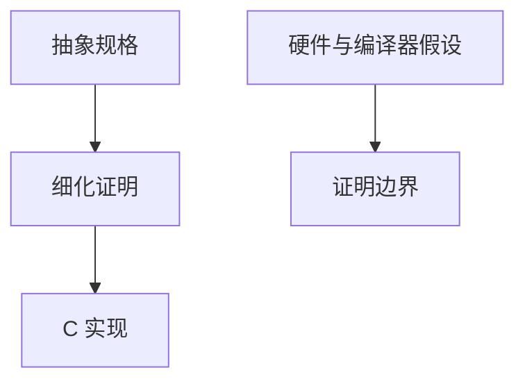

# seL4 形式验证

seL4 把微内核的功能正确与完整性不变量做到机器可检查的证明：C 实现细化到抽象规格。它示范 TCB 小到可证，不示范「所有软件都应 Coq 一遍」。

<footer>—— Klein et al., seL4: Formal Verification of an OS Kernel, SOSP 2009；后续完整性与时间隔离论文点名</footer>

## 定位

上一课[SDL](/cs/sdl-lifecycle)是过程。安全进阶最后一课用 **seL4** 把 TCB 最小化接到[证明助手](/cs/proof-assistants)的核：规格、细化、不变式。不重写 L4 IPC。

后课默认已经读完本课钉下的合同，只补差，不从该领域第一性原理重开。

## 问题

普通内核太大不能证。seL4：抽象规格 ↔ Haskell 原型 ↔ C，证明细化与无用户到内核的完整性破坏（在模型内）。缺口是：证明排除的假设（硬件、汇编、编译器）仍要另管。

### 不是万能内核

设备驱动与用户态仍要隔离策略。证明的是核，不是整个产品。

Klein et al. SOSP 2009。对照本课程开头 Shannon：一端是信息论极限，一端是可证微内核。中间是合同与误用。

## 方法

陈述细化链。指出时间隔离后续工作。课程封口：后课若有附录不插入主干。

图中节点是本课的机制骨架；课程不把图展开成可运行的攻击步骤。

## 机制

形式方法服务最小 TCB。安全进阶从一次一密走到可证内核：保密极限、计算合同、协议绑定、内存完整、观测响应、隐私预算、组织过程，最后证明核。

前提写进合同之后，游戏外的误用只当失败模式点名，不在本课写成操作程序。

## 边界

本课不把 seL4 当所有系统的必换内核。安全进阶课程到此结束。

## 小结

- SDL 是过程；seL4 是可证的最小核实例。
- 细化把规格接到 C；假设外仍要工程。
- 与开篇 Shannon 对照：极限、合同、可证 TCB。
- 安全进阶封口；证明助手课的核在此落地。
- 出处：Klein et al., SOSP 2009；对照 Shannon, 1949；[proof-assistants](/cs/proof-assistants)。
