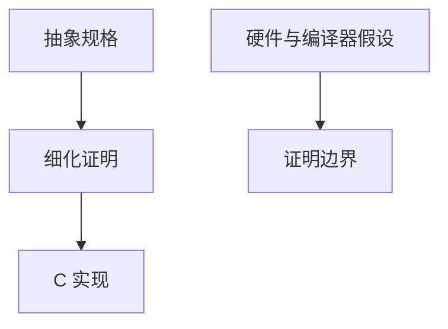
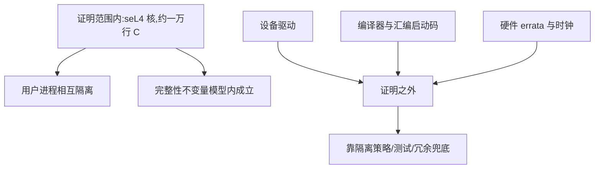

# seL4 形式验证

seL4 把微内核的功能正确与完整性不变量做到机器可检查的证明：C 实现细化到抽象规格。它示范 TCB 小到可证，不示范「所有软件都应 Coq 一遍」。

<footer>—— Klein et al., seL4: Formal Verification of an OS Kernel, SOSP 2009；后续完整性与时间隔离论文点名</footer>

上一课[SDL](/cs/sdl-lifecycle)是过程。安全进阶最后一课用 **seL4** 把 TCB 最小化接到[证明助手](/cs/proof-assistants)的核：规格、细化、不变式。不重写 L4 IPC。

后课默认已经读完本课钉下的合同，只补差，不从该领域第一性原理重开。

## 问题

普通内核太大不能证。seL4：抽象规格 ↔ Haskell 原型 ↔ C，证明细化与无用户到内核的完整性破坏（在模型内）。缺口是：证明排除的假设（硬件、汇编、编译器）仍要另管。

术语翻译「细化」：把高层的每一步承诺逐级替换成更低层的实现，并证明每一级行为一致——像把「帮我把文件存盘」这句话先落实成「写入这些扇区」，再落实成一串具体指令，每一层都要证明意思没有走样。seL4 的证明就是这种逐级对齐做到机器可检查。

### 不是万能内核

设备驱动与用户态仍要隔离策略。证明的是核，不是整个产品。

直觉类比：信任基（TCB）像城堡最内层的堡垒——墙越短越容易守。seL4 把「必须无条件信任的代码」压缩到约一万行 C；这堵墙短到可以逐块砖检查，而传统内核几千万行代码的墙，连数清砖都不可能。

Klein et al. SOSP 2009。对照本课程开头 Shannon：一端是信息论极限，一端是可证微内核。中间是合同与误用。

## 方法

陈述细化链。指出时间隔离后续工作。课程封口：后课若有附录不插入主干。

```mermaid
flowchart TD
  SPEC["抽象规格"] --> REF["细化证明"]
  REF --> C["C 实现"]
  ASSUME["硬件与编译器假设"] --> LIM["证明边界"]
```

## 机制

形式方法服务最小 TCB。安全进阶从一次一密走到可证内核：保密极限、计算合同、协议绑定、内存完整、观测响应、隐私预算、组织过程，最后证明核。

常见误区：初学者以为「形式验证过的内核就没有 bug」。实际上证明只在模型内成立——定理说的是「这份 C 代码细化了这个规格」；编译器有没有 bug、硬件有没有勘误、汇编启动代码对不对，都在证明范围之外，仍要靠工程手段兜底。

```mermaid
flowchart TD
  PROV["证明范围内:seL4 核,约一万行 C"] --> G1["用户进程相互隔离"]
  PROV --> G2["完整性不变量模型内成立"]
  OUT1["设备驱动"] --> OUT["证明之外"]
  OUT2["编译器与汇编启动码"] --> OUT
  OUT3["硬件 errata 与时钟"] --> OUT
  OUT --> RES["靠隔离策略/测试/冗余兜底"]
```

## 边界

本课不把 seL4 当所有系统的必换内核。安全进阶课程到此结束。

## 小结

- SDL 是过程；seL4 是可证的最小核实例。
- 细化把规格接到 C；假设外仍要工程。
- 与开篇 Shannon 对照：极限、合同、可证 TCB。
- 安全进阶封口；证明助手课的核在此落地。
- 出处：Klein et al., SOSP 2009；对照 Shannon, 1949；[proof-assistants](/cs/proof-assistants)。
