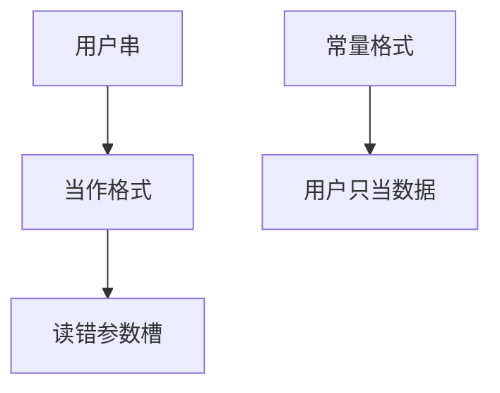

# 格式化字符串

`printf` 的格式串是微型语言。若把用户输入当成格式，说明符会去读（历史上甚至写）栈上的参数槽。正确合同：格式串是程序员常量。

<footer>—— 据 CWE-134；对照 Newsham 与其他早期公开分析；ISO C `fprintf` 合同</footer>

## 定位

上一课[整数溢出](/cs/integer-overflow-bugs)是算术。缺口是**解释器**：格式化字符串。本课钉「不可把不可信串当格式」，不给 `%n` 利用步骤。

后课默认已经读完本课钉下的合同，只补差，不从该领域第一性原理重开。

## 问题

日志写成 `printf(user)`。说明符消耗参数，错位则泄栈，危险说明符曾能写内存。缺口是 API 选择：`printf("%s", user)`。编译器 `-Wformat-security` 抓一部分。

### %n 已在许多 libc 弱化

即使写功能被关，信息泄漏仍在。合同仍是：格式常量。

CWE-134。本课禁止构造恶意格式串作业。

## 方法

对照安全与不安全调用。指出日志库应自带格式。类型混淆下一课把「解释错误」升到对象类型层。

图中节点是本课的机制骨架；课程不把图展开成可运行的攻击步骤。

## 机制

输入不应选择解释规则。下一课类型混淆：在对象层选错虚表或 union。

前提写进合同之后，游戏外的误用只当失败模式点名，不在本课写成操作程序。

## 边界

本课无泄漏配方。类型混淆下一课。

## 小结

- 长度算错之外，格式串是微型语言。
- 不可信数据不得当格式。
- 编译器警告是辅助，不是证明。
- 下一课类型混淆。
- 出处：CWE-134；ISO C；对照 Szekeres SoK。
