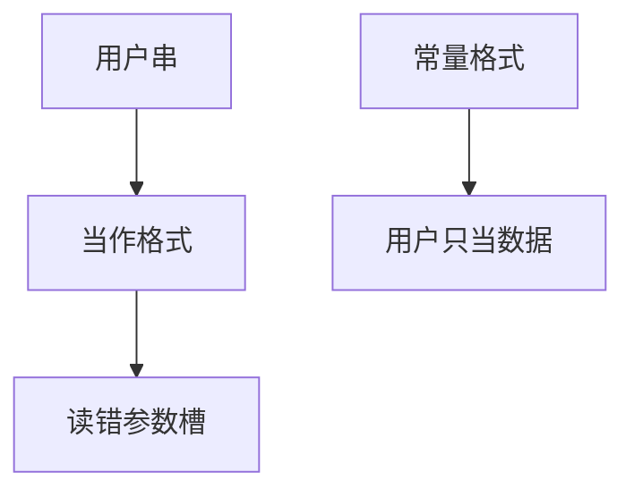

# 格式化字符串

`printf` 的格式串是微型语言。若把用户输入当成格式，说明符会去读（历史上甚至写）栈上的参数槽。正确合同：格式串是程序员常量。

<footer>—— 据 CWE-134；对照 Newsham 与其他早期公开分析；ISO C `fprintf` 合同</footer>

上一课[整数溢出](/cs/integer-overflow-bugs)的洞出在算术上，本课的洞出在**解释**上：同一段字节被当成微型语言执行。合同一句话：格式串必须是程序员写死的常量，不可信数据只能作实参进去。本课钉下这份合同，不给 `%n` 的利用步骤。

后课默认已经读完本课钉下的合同，只补差，不从该领域第一性原理重开。

## 问题

典型现场是日志：`printf(user)`。C 的变参机制不携带参数个数与类型信息，`printf` 全靠扫格式串自数：每遇一个说明符就取下一个参数。参数不够时它不报错，继续向栈上取——取到的是调用现场残留的任何字节，解释全由攻击者的串指挥：`%x` 把残留当十六进制吐进日志，`%s` 更把残留值当指针去解引用；历史上 `%n` 还能把已输出字节数写进指定地址，把一次日志调用变成写内存的原语。修法在 API 层：`printf("%s", user)`，让用户串只当数据。编译器 `-Wformat-security` 能抓「格式位不是字面量」的一部分，抓不完。

### %n 已在许多 libc 弱化

许多 libc 已把 `%n` 弱化（只读段、FORTIFY 检查），但只要格式串可控，读栈的泄漏就还在。合同不因缓解而放松：格式常量。

CWE-134。本课禁止构造恶意格式串作业。

## 方法

方法是对着写：同一行日志，不安全调用把用户串放格式位，安全调用把它降为 `%s` 实参；判断标准只有一条——格式位上是谁写的字符串。日志库应当自带格式、调用者只传参数，把「格式常量」做进接口，让错误调用写不出来。类型混淆下一课把「解释错误」升到对象层。

```mermaid
flowchart TD
  USER["用户串"] --> BAD["当作格式"]
  BAD --> LEAK["读错参数槽"]
  CST["常量格式"] --> OK["用户只当数据"]
```

## 机制

深一层的读法：这份合同把「数据」与「解释规则」分开——输入只能是数据，解释规则必须由程序固定。`printf(user)` 的错误正是让输入选择解释规则，顺带选择了去读哪些内存；这不是越界，是授了解释权。下一课类型混淆是同一原理的对象层版本：选错虚表或 union 分支，同样是解释规则与对象不匹配。

## 边界

本课不给泄漏或写入的配方，说明符语义以 ISO C 的 `fprintf` 合同为准；类型混淆在下一课。

## 小结

- 长度算错之外，格式串是微型语言。
- 不可信数据不得当格式。
- 编译器警告是辅助，不是证明。
- 下一课类型混淆。
- 出处：CWE-134；ISO C；对照 Szekeres SoK。
