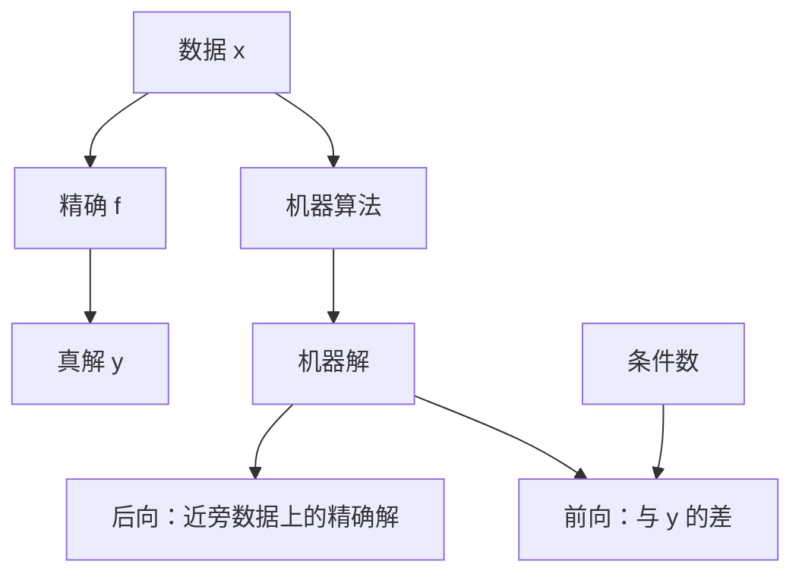

# 前向稳定与后向稳定

后向稳定说：机器算出的是一个近旁问题的精确解；前向稳定说：机器解与真解的差被条件数允许的量级兜住。

<footer>—— 据 Higham, Accuracy and Stability of Numerical Algorithms；Trefethen and Bau, Numerical Linear Algebra 整理</footer>

上一课[条件数](/cs/condition-number)把问题敏感度从算法里抽出。本课不重导 $\kappa$，也不从 IEEE 舍入模式另起。缺口是：$\gamma_n$ 跟踪的是运算注入，条件数跟踪的是 $f$——**怎样把「算法够不够好」说成一句可检验的话**。Higham 的前向/后向误差就是这句。

## 问题

真解 $y=f(x)$，机器给出 $\hat y$。前向误差是 $\hat y$ 与 $y$ 的差（相对或绝对）。后向误差是：存在多重小扰动 $\delta x$，使得 $\hat y=f(x+\delta x)$；其中最小的 $\|\delta x\|$ 量级就是后向误差。缺口因此不是再举一个溢出例子，而是**改写问题**：不把 $\hat y$ 当成「算错的 $y$」，而问它是不是「稍稍改过的数据上的正确 $y$」。后向小，则前向大约被 $\kappa$ 放大，与上一课衔接。

许多分解算法（后课高斯消元）逐条指令的前向误差难看清，后向图像却干净：算出的因子是某个 $A+\Delta A$ 的精确因子。这是数值线性代数的标准叙事。本课先定义，消元细节下一单元再给。

### 后向稳定不是「结果很准」

后向稳定而病态：$\hat y$ 对真 $y$ 仍可差很远，只是对某个近旁问题很准。用户若把数据当绝对真，会误以为算法失败。前向稳定更强、更少见：它要求 $\hat y$ 接近 $y$，哪怕你不改写数据。不稳定指后向误差远大于舍入单位，例如灾难抵消后的公式。三种词不能互换。

Trefethen and Bau Lecture 12–14 把后向稳定当作算法的合格线。Higham 强调：后向误差用数据的范数量，前向误差用解的范数量，中间隔着条件数。

## 方法

检验后向稳定：把残量或等价扰动写出来，看 $\|\Delta A\|/\|A\|$ 是否 $O(u)$。前向：直接比 $\hat y$ 与（更高精度或解析的）$y$。混合：先证后向，再乘 $\kappa$ 得前向估计。残量小不等于解准——那正是 $\kappa$ 大时的现象；残量小通常支持后向小。

「逐步」后向稳定：每一步都是对当时输入的后向精确。复合之后整体后向是否仍小，要另证；这是后课消元与迭代各自要做的。

前向误差界 $\kappa\times$ 后向误差是一阶图像，忽略 $\kappa\,u\approx 1$ 时的非线性。当问题已经病到机器精度下不可分辨多个解，稳定算法会交出「某一个近旁问题的解」，不同实现可以差得很远却都后向合格。规格若要求位对位相同，必须固定算法、顺序与舍入模式，而不是只要求稳定。消去课会给出公式级的反例：代数恒等变换可以毁掉后向稳定。先把合格线定在后向上，再去改写公式。

## 机制

后向观点匹配浮点的 $(1+\delta)$：每步都在改数据。若整条算法等价于「只在入口改一次 $O(u)$ 再精确算下去」，用户可以诚实地说：我解的是测量误差范围内的问题。前向观点匹配「我必须拿到这个 $y$」。求值病态的 $f$ 时，后向稳定是合理目标；前向稳定可能要求改问题（换基、换未知量）。下一课消去会展示：代数等价的公式可以一个后向稳定、一个不是。

混合稳定允许后向误差用稍大的范数或分量意义来量，前向仍被 $\kappa$ 控制。实践中 BLAS 的常数因子可以是 $n$ 的低次多项式，仍视为稳定。对照：显式形成法向量 $A^\top A$ 再消元，是经典的不稳定——$\kappa$ 被平方。算法选择在此比调 $u$ 更重要。残量小、后向小、前向大，是在告诉你问题病态，数据不支撑你要的那些位数。把三种误差画在同一张图上，数值课剩下的消元、迭代、牛顿、插值才有共同语言。

## 边界

本课不证明某条 BLAS 的常数，不把混合稳定的细分类写完。下一课[消去与灾难抵消](/cs/catastrophic-cancellation)给最常见的不稳定模式。后课默认：好算法首先追求后向稳定；前向误差用 $\kappa$ 估计；残量小不保证解准。

## 小结

- 后向误差：$\hat y$ 是近旁数据的精确解；前向误差：$\hat y$ 与真 $y$ 的差。
- 后向稳定 $\times$ 条件数 $\approx$ 前向误差量级。
- 病态且后向稳定时，解可以仍不准，算法却已尽责。
- 下一课看代数等价公式如何失去后向稳定。
- 出处：Higham；Trefethen and Bau。
